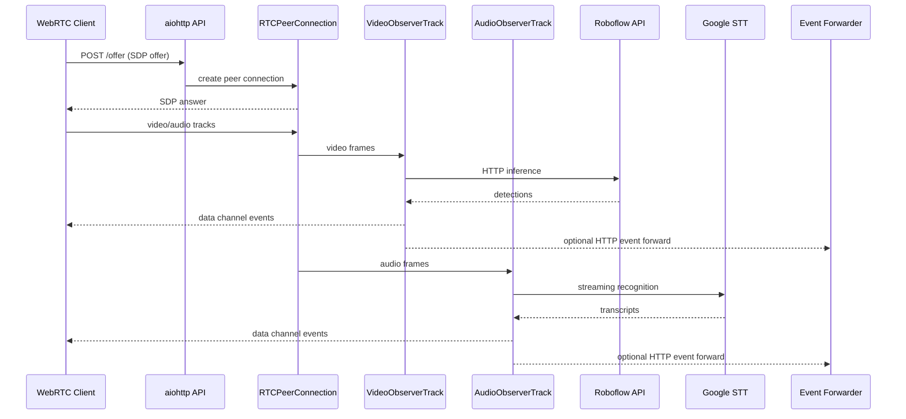
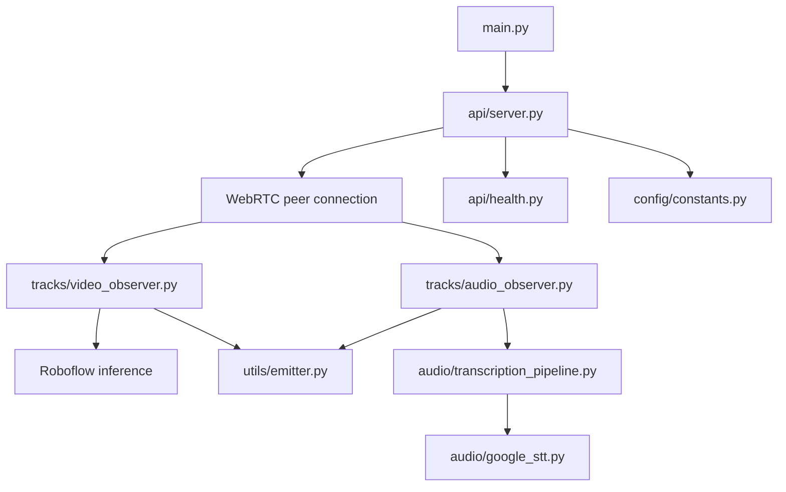

# Medical Triage Processor WebRTC Server

Realtime audio/video emotion detection with speech transcription for AI-assisted medical triage. Accepts video/audio streams via WebRTC and emits detection, emotion and transcription events in real time to assist triage workflows.

## Architecture

### Dataflow (sequence)



### Summarized structure (components)



## How to run locally

### Option 1: Docker Compose

```powershell
cp .env.example .env
# Edit .env and set ROBOFLOW_API_KEY

docker-compose up -d
docker-compose logs -f
```

Health checks:

```powershell
curl http://localhost:8000/health
curl http://localhost:8000/ready
```

### Option 2: Python venv

```powershell
python -m venv .venv
.\.venv\Scripts\Activate.ps1

pip install --upgrade pip
pip install -r requirements.txt

cp .env.example .env
# Edit .env and set ROBOFLOW_API_KEY

python main.py
```

## External API dependencies

### Roboflow

Used by the video pipeline in [tracks/video_observer.py](tracks/video_observer.py). Requires:

- `ROBOFLOW_API_KEY` (required)
- `ROBOFLOW_MODEL_ID`
- `ROBOFLOW_API_URL` (optional override)

See [config/constants.py](config/constants.py) for defaults and names.

### Google Speech-to-Text (STT)

Used by the audio pipeline in [audio/google_stt.py](audio/google_stt.py). Requires:

- `GOOGLE_APPLICATION_CREDENTIALS` pointing to a service account JSON file
- `STT_LANGUAGE`, `STT_MAX_DURATION_SEC`, and related `STT_*` settings

See [config/constants.py](config/constants.py) and [quickstart.md](quickstart.md) for setup details and Docker volume guidance.
# Test
curl http://localhost:8080/health
```

### Code Style

```bash
# Format with ruff
ruff check .

# Auto-fix issues
ruff check --fix .
```

## Resource Requirements
- Python 3.11+
- 2GB RAM minimum

## Monitoring

### Health Endpoints

- **`GET /health`**: Liveness probe (always returns 200)
- **`GET /ready`**: Readiness probe (checks dependencies)