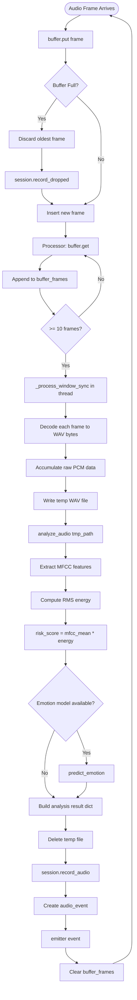
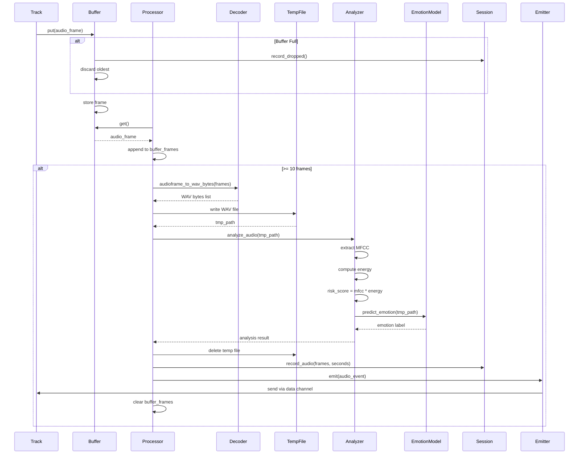
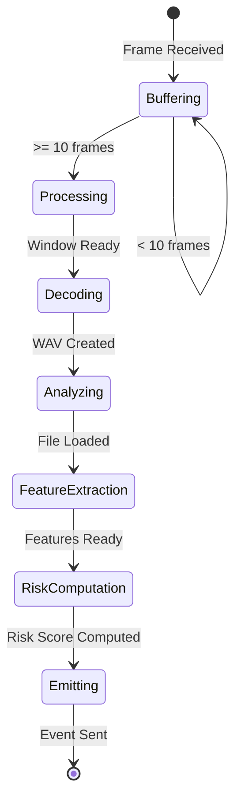

# Audio Analysis Pipeline

## Context

**Bounded Context:** Media Processing

## Summary

When an audio [Track](../ubiquitous-language.md#track) delivers audio frames via WebRTC, the [Audio Processor](../ubiquitous-language.md#audio-processor) collects frames into time windows (default 1 second), converts them to WAV format, extracts acoustic features (MFCC, energy), runs speech [Emotion Recognition](../ubiquitous-language.md#emotion-recognition), computes a [Risk Score](../ubiquitous-language.md#risk-score), and emits audio analysis events to the client via the data channel.

## Description

This flow complements the video processing pipeline by analyzing vocal characteristics for psychological risk indicators. Unlike video frames which are processed individually, audio frames are batched into windows to accumulate sufficient signal for meaningful analysis. The pipeline uses MFCC (Mel-Frequency Cepstral Coefficients) for speech feature extraction and Wav2Vec2-based emotion recognition models.

## Actors

- **WebRTC Audio Track**: Delivers raw audio frames from client's microphone
- **Audio Buffer**: Large queue (maxsize=1024) for audio frame accumulation
- **Audio Processor**: Async worker managing windowing and analysis
- **Audio Decoder**: Converts WebRTC audio frames to WAV format
- **Audio Analysis Service**: Extracts features (MFCC, energy) and computes risk scores
- **Emotion Recognition Model**: Classifies emotional states from audio
- **Emitter**: Sends audio events through data channel to client

## Preconditions

- [Session](../ubiquitous-language.md#session) is active
- Audio track is delivering frames
- [Audio Buffer](../ubiquitous-language.md#audio-buffer) is initialized with maxsize=1024
- Audio Processor is started with emitter callback and window_seconds parameter (default 1.0)
- Temporary file system access available for WAV file creation

## Main Flow

1. WebRTC audio track receives audio frame from client microphone
2. Track handler calls `buffer.put(frame)` to enqueue [Audio Frame](../ubiquitous-language.md#audio-frame)
3. **If buffer is full** (1024 frames), oldest frame is discarded (drop-replace policy) and `session.record_dropped()` called
4. Audio Processor awaits `buffer.get()` and retrieves frame
5. Processor appends frame to internal `buffer_frames` list
6. **If buffer_frames length < 10**, processor returns to step 4 (continue collecting)
7. **If buffer_frames length >= 10**, processor calls `_process_window(buffer_frames, emitter)`
8. Processor executes `_process_window_sync()` in thread pool (via `asyncio.to_thread()`) to avoid blocking event loop
9. Decoder converts each frame to WAV bytes using `audioframe_to_wav_bytes(frame)`
10. **If frame decode fails**, frame is skipped with warning logged
11. Decoder extracts sample rate (48000 Hz default) and channels (1 = mono default)
12. Decoder strips WAV header (finds "data" chunk) and accumulates raw PCM bytes
13. Processor creates temporary WAV file with `tempfile.NamedTemporaryFile(suffix=".wav", delete=False)`
14. Processor writes WAV header + raw PCM data to temp file
15. Processor calls `analyze_audio(tmp_path)` synchronously
16. Analysis loads WAV file and extracts MFCC features using librosa
17. Analysis computes energy (RMS) from audio signal
18. Analysis computes `risk_score = mfcc_mean * energy` (heuristic formula)
19. Optionally, analysis calls `predict_emotion(tmp_path)` for Wav2Vec2-based emotion classification
20. Analysis returns result dict: `{risk_score, mfcc_mean, energy, emotion?}`
21. Processor deletes temporary WAV file
22. Processor computes `audio_seconds` from total bytes, sample rate, and channels
23. Processor calls `session.record_audio(frames=len(frames), seconds=audio_seconds)`
24. Processor constructs audio_event dict:
    - `event_type: "audio_event"`
    - `session_id`
    - `timestamp_ms`
    - `analysis` (risk score, MFCC, energy, emotion)
    - `audio_seconds`
    - `frames` count
    - `window_seconds`
25. Processor calls `await emitter(audio_event)` to send via data channel
26. Client receives audio analysis event
27. Processor clears `buffer_frames` list and returns to step 4 for next window

## Alternative Flows

### A1: Frame Decode Failure

**Trigger:** `audioframe_to_wav_bytes()` raises exception (invalid audio format, corrupted packet)

**Steps:**
1. Exception caught during decode (step 9)
2. Warning logged: "skip frame decode: <error>"
3. Frame skipped, not included in WAV accumulation
4. Processor continues with remaining frames in window
5. **If all frames fail**, empty WAV may be created (handled by analysis returning default values)

**Outcome:** Window processed with partial data; risk score may be less accurate

### A2: Temporary File Creation Failure

**Trigger:** File system full, permissions error, or tempfile module fails

**Steps:**
1. Exception raised during temp file creation (step 13)
2. Exception caught in `_process_window()` error handler
3. Error logged: "audio processing error: <details>"
4. Window skipped entirely
5. `buffer_frames` not cleared (frames lost)
6. Processor continues to next window

**Outcome:** Single window dropped; session continues

### A3: Emotion Recognition Unavailable

**Trigger:** Wav2Vec2 model not loaded or `predict_emotion()` disabled

**Steps:**
1. Analysis completes MFCC and risk score computation (steps 16-18)
2. Emotion prediction skipped or returns None
3. Analysis result contains risk score but no emotion field
4. Audio event emitted without emotion classification

**Outcome:** Risk score available; emotion data missing

### A4: Audio Track Ends Mid-Window

**Trigger:** Track ends before 10 frames collected

**Steps:**
1. Processor stopped (track ended event)
2. `_run()` loop exits with `_stop=True`
3. Remaining frames in `buffer_frames` (< 10) processed via "process remaining" logic (step 45 in code)
4. Partial window analyzed and emitted
5. Processor shuts down

**Outcome:** Final partial window processed; no frames lost

### A5: High Risk Score Detected

**Trigger:** Risk score exceeds threshold (e.g., > 0.5)

**Steps:**
1. Audio analysis computes `risk_score = 0.87` (above threshold)
2. Audio event emitted normally with risk score included
3. Client receives event and displays risk alert UI
4. Optionally, alert service triggered (see [Wound Detection and Alert Generation](wound-detection-and-alert-generation.md))

**Outcome:** Client notified of elevated risk; further action may be triggered

## Business Rules

- **Window Size:** Default 1.0 second per window, configurable via `window_seconds` parameter
- **Frame Batch Threshold:** Minimum 10 frames required to trigger window processing
- **Sample Rate Standard:** 48000 Hz (WebRTC default for audio)
- **Channel Configuration:** Mono (1 channel) preferred; stereo may be downmixed
- **Risk Score Formula:** `risk_score = mfcc_mean * energy` (heuristic, not clinically validated)
- **Risk Threshold:** No hardcoded threshold in processor; interpretation left to client or alert service
- **Temporary File Cleanup:** WAV files must be deleted after analysis to prevent disk exhaustion
- **Audio Buffer Size:** 1024 frames (vs. 1 for video) to accommodate windowing needs
- **Thread Offloading:** Synchronous audio analysis must run in thread pool to avoid blocking async loop

## Data / Events

### Input: WebRTC Audio Frame

Binary audio packet (Opus encoded typically) from MediaStreamTrack

### Output: Audio Event (JSON via Data Channel)

```json
{
  "event_type": "audio_event",
  "session_id": "550e8400-e29b-41d4-a716-446655440000",
  "timestamp_ms": 1640995201234,
  "analysis": {
    "risk_score": 0.42,
    "mfcc_mean": 12.5,
    "energy": 0.034,
    "emotion": "neutral"
  },
  "audio_seconds": 1.02,
  "frames": 12,
  "window_seconds": 1.0
}
```

### Session Audio Metrics

- `audio_frame_count`: Total frames received and processed
- `audio_seconds`: Cumulative audio duration analyzed (float)

## Flow Diagram



## Sequence Diagram



## State Transitions



## Acceptance Criteria / Tests

1. **Given** 10 audio frames in buffer, **when** processor runs, **then** audio_event is emitted with analysis results
2. **Given** audio_seconds computed from frames, **when** event emitted, **then** duration matches expected value (frames / sample_rate * channels)
3. **Given** MFCC mean = 10.0 and energy = 0.05, **when** risk score computed, **then** risk_score = 0.5
4. **Given** temporary WAV file created, **when** analysis completes, **then** file is deleted
5. **Given** frame decode fails, **when** window processed, **then** warning logged and remaining frames analyzed
6. **Given** emotion model unavailable, **when** analysis runs, **then** event emitted without emotion field
7. **Given** audio track ends with 5 frames buffered, **when** processor stops, **then** partial window processed and emitted

## Related Domain Terms

- [Audio Frame](../ubiquitous-language.md#audio-frame)
- [Audio Buffer](../ubiquitous-language.md#audio-buffer)
- [Audio Processor](../ubiquitous-language.md#audio-processor)
- [Emotion Recognition](../ubiquitous-language.md#emotion-recognition)
- [Risk Score](../ubiquitous-language.md#risk-score)
- [Session](../ubiquitous-language.md#session)
- [Track](../ubiquitous-language.md#track)

## Related Flows

- [WebRTC Session Establishment](webrtc-session-establishment.md) — precedes this flow
- [Video Frame Processing Pipeline](video-frame-processing-pipeline.md) — parallel video processing
- [Session Closure and Reporting](session-closure-and-reporting.md) — terminates processing

## Notes & Open Questions

- **Q:** Why is the risk score formula `mfcc_mean * energy`?  
  **A:** Heuristic formula; not clinically validated. Should be replaced with trained model.

- **Q:** What is the valid range for risk scores?  
  **A:** Unbounded in current implementation; typically 0.0 to ~1.0 but can exceed.

- **Q:** Should audio and video events be synchronized by timestamp?  
  **A:** Not currently synchronized; each track emits independently. Client responsible for correlation.

- **Q:** How to handle audio clipping or silence detection?  
  **A:** Not implemented; could add silence detection to skip low-energy windows.

- **Missing Term:** "MFCC", "RMS Energy", "Wav2Vec2" not defined in ubiquitous-language.md; consider adding technical glossary.

## Changelog

| Date       | Author                      | Change                        |
|------------|-----------------------------|-------------------------------|
| 2026-01-24 | flow-documentation-agent    | Initial flow documentation    |
