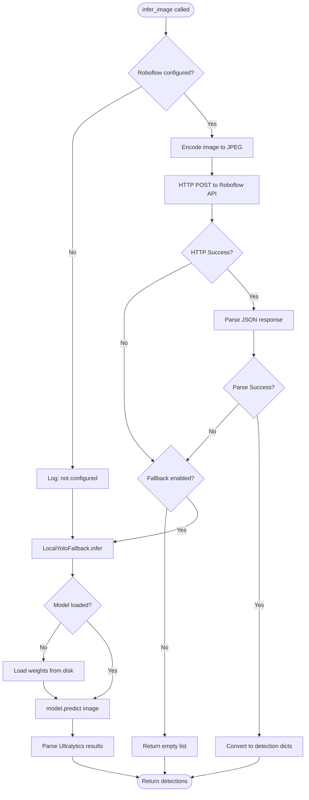
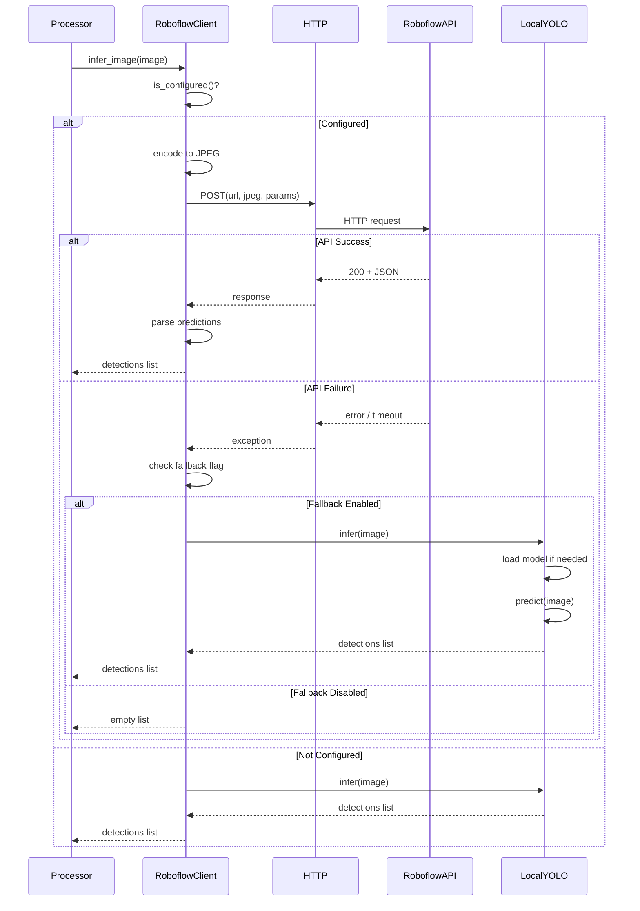
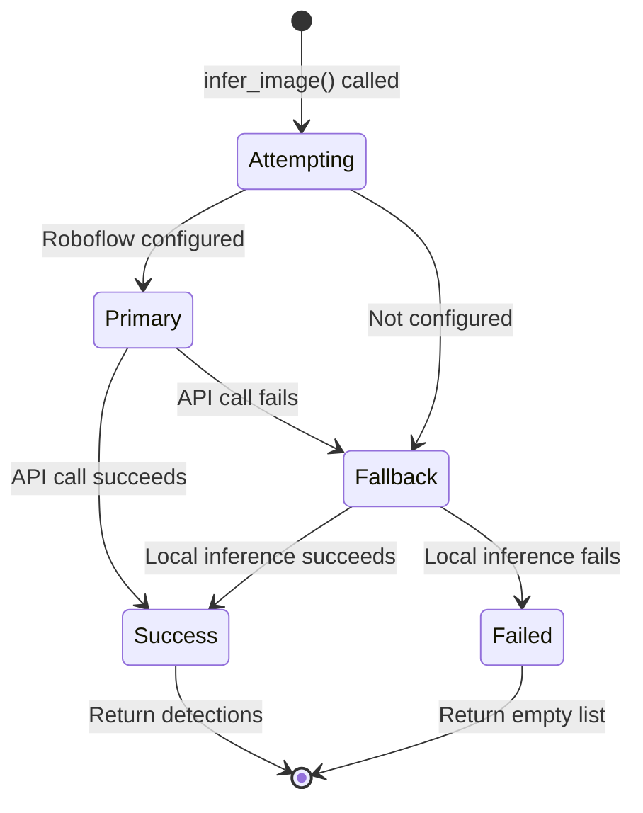

# Inference Fallback Handling

## Context

**Bounded Context:** Inference Infrastructure

## Summary

When the [Roboflow Client](../ubiquitous-language.md#roboflow-client) attempts to send an image to the hosted API for [Inference](../ubiquitous-language.md#inference) and encounters errors (network failure, API timeout, authentication errors, or response parsing issues), the system automatically falls back to a [Local YOLO](../ubiquitous-language.md#local-yolo) model running on the server, ensuring uninterrupted wound detection even when external services are unavailable.

## Description

This flow implements a resilience pattern that protects the video processing pipeline from external API failures. The fallback is transparent to the calling processor—it always receives a list of detections regardless of which inference backend succeeded. The behavior is controlled by the `ROBOFLOW_USE_LOCAL_FALLBACK` environment variable and relies on pre-loaded local YOLO model weights.

## Actors

- **Roboflow Client**: Primary inference service making HTTP API calls
- **Local YOLO Fallback**: Secondary inference service running Ultralytics YOLOv8 locally
- **Frame Processor**: Consumer of inference results (unaware of which backend is used)
- **HTTP Client (httpx)**: Handles network communication to Roboflow API

## Preconditions

- Roboflow API credentials configured (`ROBOFLOW_MODEL_URL`, `ROBOFLOW_API_KEY`)
- Local fallback enabled via `ROBOFLOW_USE_LOCAL_FALLBACK=true` environment variable
- Local YOLO model weights file present (e.g., `yolov8n.pt`) and loadable
- Image is prepared (decoded, resized) and ready for inference

## Main Flow

1. Frame Processor calls `infer_image(image)` with NumPy array
2. Roboflow Client checks `is_configured()` to verify API credentials present
3. **If Roboflow not configured**, skip directly to step 14 (local fallback)
4. Roboflow Client encodes image to JPEG format using `cv2.imencode()`
5. Client constructs HTTP POST request with API key and confidence threshold parameters
6. Client sends async HTTP POST to `ROBOFLOW_MODEL_URL` with JPEG bytes and timeout=10s
7. HTTP request completes successfully (status 200)
8. Client parses JSON response body
9. Client extracts `predictions` array from response
10. Client converts each prediction to standardized detection dict: `{id, cls, bbox, confidence, type_confidence}`
11. Client returns detections list to Frame Processor
12. **If steps 6-10 succeed**, flow completes successfully (no fallback triggered)
13. Frame Processor receives detections and continues normal processing
14. **If any error occurs** in steps 4-10 (network error, timeout, HTTP error status, JSON parse error):
    - Client logs error with context
    - Client checks `use_local_fallback` flag
    - **If fallback disabled** (`use_local_fallback=false`), return empty list
    - **If fallback enabled**, continue to step 15
15. Client calls `LocalYoloFallback.infer(image)`
16. Local YOLO loads model weights (if not already loaded in memory)
17. Local YOLO runs synchronous prediction: `model.predict(image)`
18. Local YOLO parses Ultralytics Results object into detection dicts
19. Local YOLO returns detections list
20. Client returns local fallback detections to Frame Processor
21. Frame Processor receives detections (unaware of fallback) and continues normal processing

## Alternative Flows

### A1: Roboflow API Not Configured

**Trigger:** `ROBOFLOW_MODEL_URL` or `ROBOFLOW_API_KEY` environment variables missing or empty

**Steps:**
1. `infer_image()` called
2. `RoboflowConfig.is_configured()` returns False
3. Client logs "Roboflow not configured, using fallback"
4. Flow jumps directly to step 15 (local YOLO)
5. Local inference completes successfully

**Outcome:** System operates entirely on local inference; no API calls attempted

### A2: Local Fallback Disabled

**Trigger:** `ROBOFLOW_USE_LOCAL_FALLBACK=false` in environment

**Steps:**
1. Roboflow API call fails (step 14)
2. Client checks `use_local_fallback` flag
3. Flag is False
4. Client logs warning: "Fallback disabled, returning empty detections"
5. Empty list `[]` returned to Frame Processor
6. Detection event emitted with `has_wounds=false`

**Outcome:** Inference failure results in no detections; client notified via empty event

### A3: Local Model File Missing

**Trigger:** Local YOLO weights file (e.g., `yolov8n.pt`) not found on disk

**Steps:**
1. Fallback triggered, `LocalYoloFallback.infer()` called
2. Ultralytics library attempts to load model
3. FileNotFoundError raised
4. Exception caught and logged
5. Empty list returned
6. Frame Processor receives empty detections

**Outcome:** Both primary and fallback fail; frame processed as "no detections"

### A4: Timeout on Roboflow API Call

**Trigger:** HTTP request exceeds DEFAULT_HTTP_TIMEOUT (10 seconds)

**Steps:**
1. HTTP POST sent to Roboflow
2. Response not received within 10 seconds
3. `httpx.TimeoutException` raised
4. Exception caught by error handler
5. Fallback triggered (step 15)
6. Local YOLO completes inference successfully

**Outcome:** Temporary network issue handled gracefully via fallback

### A5: Invalid Response Format from Roboflow

**Trigger:** API returns 200 but JSON does not contain expected `predictions` field

**Steps:**
1. HTTP POST succeeds with status 200
2. JSON parsing succeeds
3. `response_data.get("predictions")` returns None or invalid structure
4. `DetectionParser.parse_predictions()` returns empty list or raises exception
5. Exception caught, fallback triggered
6. Local YOLO returns valid detections

**Outcome:** API contract mismatch handled transparently

## Business Rules

- **Fallback Priority:** Always attempt Roboflow API first if configured; fallback is secondary
- **Transparent Switching:** Frame Processor must not need to know which backend was used
- **Local Model Persistence:** Local YOLO model should be loaded once and cached in memory
- **Timeout Policy:** API requests timeout after 10 seconds (configurable via DEFAULT_HTTP_TIMEOUT)
- **Empty Results Policy:** If both primary and fallback fail, return empty list (not None or exception)
- **Confidence Threshold:** Both Roboflow and Local YOLO must respect configured confidence threshold (default 0.5)
- **Detection Format Consistency:** Both backends must return identical dict structure: `{id, cls, bbox, confidence, type_confidence}`

## Data / Events

### Input: Prepared Image (NumPy array)

- Shape: (H, W, 3) where H, W ≤ 720p after resizing
- Dtype: uint8
- Color space: BGR (OpenCV convention)

### Output: Detections List

```python
[
  {
    "id": 0,
    "cls": "cut",
    "bbox": [120.5, 200.3, 45.0, 60.0],  # [x, y, w, h]
    "confidence": 0.92,
    "type_confidence": 0.88
  },
  {
    "id": 1,
    "cls": "bruise",
    "bbox": [300.0, 150.0, 60.0, 55.0],
    "confidence": 0.85,
    "type_confidence": 0.82
  }
]
```

### Log Events

**Fallback Triggered:**
```
WARNING: Roboflow inference failed: <error details>. Using local fallback.
```

**Fallback Disabled:**
```
WARNING: Roboflow inference failed and fallback disabled. Returning empty detections.
```

## Flow Diagram



## Sequence Diagram



## State Transitions



## Acceptance Criteria / Tests

1. **Given** Roboflow API configured and reachable, **when** `infer_image()` called, **then** detections returned from API (no fallback triggered)
2. **Given** Roboflow API times out, **when** fallback enabled, **then** local YOLO returns detections successfully
3. **Given** Roboflow not configured, **when** `infer_image()` called, **then** local YOLO used immediately (no API attempt)
4. **Given** fallback disabled and API fails, **when** `infer_image()` called, **then** empty list returned
5. **Given** local model file missing, **when** fallback triggered, **then** exception logged and empty list returned
6. **Given** both Roboflow and local YOLO succeed in separate calls, **when** results compared, **then** detection dict format is identical
7. **Given** API returns malformed JSON, **when** parsing fails, **then** fallback triggered without crashing

## Related Domain Terms

- [Inference](../ubiquitous-language.md#inference)
- [Roboflow Client](../ubiquitous-language.md#roboflow-client)
- [Local YOLO](../ubiquitous-language.md#local-yolo)
- [Fallback Inference](../ubiquitous-language.md#fallback-inference)
- [Wound](../ubiquitous-language.md#wound)
- [Confidence](../ubiquitous-language.md#confidence)

## Related Flows

- [Video Frame Processing Pipeline](video-frame-processing-pipeline.md) — calls `infer_image()` as part of frame processing
- [Wound Detection and Alert Generation](wound-detection-and-alert-generation.md) — consumes inference results

## Notes & Open Questions

- **Q:** Should fallback success/failure be exposed in detection event metadata?  
  **A:** Not currently included; could add `inference_source: "roboflow"` or `"local"` field.

- **Q:** What if local model is significantly slower than API?  
  **A:** Local inference is synchronous and may increase latency; consider offloading to process pool.

- **Q:** Should system retry Roboflow after fallback succeeds?  
  **A:** No automatic retry; system continues using fallback for remainder of session. Could implement periodic health check.

- **Q:** How to handle model version mismatches between Roboflow and local?  
  **A:** Not documented; ensure local weights match Roboflow model training version.

- **Missing Term:** "Model Loading" and "Weight Caching" strategies not defined in ubiquitous-language.md.

## Changelog

| Date       | Author                      | Change                        |
|------------|-----------------------------|-------------------------------|
| 2026-01-24 | flow-documentation-agent    | Initial flow documentation    |
