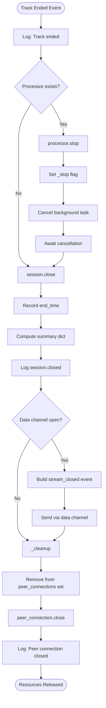
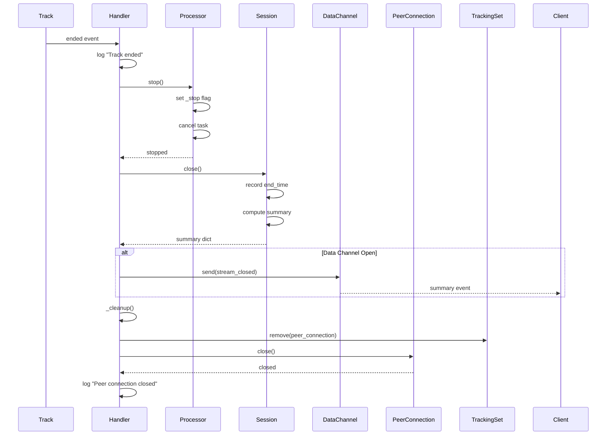
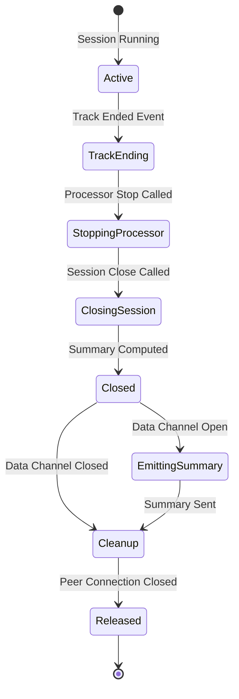

# Session Closure and Reporting

## Context

**Bounded Context:** Streaming Infrastructure

## Summary

When a WebRTC [Track](../ubiquitous-language.md#track) ends (due to client disconnection, intentional stream stop, or error), the system stops all associated [Processors](../ubiquitous-language.md#processor), closes the [Session](../ubiquitous-language.md#session), computes a [Session Summary](../ubiquitous-language.md#session-summary) with metrics (frames processed, detections, duration), emits the summary to the client via the [Data Channel](../ubiquitous-language.md#data-channel), and cleans up all resources including the [Peer Connection](../ubiquitous-language.md#peer-connection).

## Description

This flow ensures orderly shutdown of streaming sessions, preventing resource leaks and providing clients with comprehensive statistics about the completed session. The summary includes counters for total frames received, frames processed, frames dropped due to backpressure, total wounds detected, audio metrics (if audio track present), and session duration.

## Actors

- **WebRTC Track**: Media stream that triggers end event
- **WebRTC Connection Handler**: Orchestrates shutdown sequence
- **Video Processor / Audio Processor**: Background workers to be stopped
- **Session**: Maintains counters and lifecycle timestamps
- **Data Channel**: Delivers final summary message to client
- **Peer Connection**: WebRTC connection to be closed
- **Global Tracking Set**: Server-wide collection of active peer connections

## Preconditions

- [Session](../ubiquitous-language.md#session) is active with valid session_id
- At least one [Track](../ubiquitous-language.md#track) is being processed
- [Processor](../ubiquitous-language.md#processor) is running (started previously)
- [Peer Connection](../ubiquitous-language.md#peer-connection) exists in global tracking set
- [Data Channel](../ubiquitous-language.md#data-channel) may be open or closed

## Main Flow

1. WebRTC Track stops delivering frames (track ended event fires)
2. Track buffer loop (`_buffer_frames`) catches exception from `track.recv()`
3. Exception logged: "Track ended or error: <details>"
4. Track ended callback `on_ended()` fires
5. Handler logs "Track ended" message
6. Handler checks if processor exists
7. **If processor exists**, handler calls `await processor.stop()`
8. Processor sets internal `_stop` flag to True
9. Processor cancels background task (asyncio.Task.cancel())
10. Processor awaits task cancellation completion
11. Task cleanup completes (CancelledError caught and handled)
12. Handler calls `session.close()` to finalize session
13. Session records `end_time = time.time()`
14. Session computes summary dict with:
    - `session_id`
    - `start_time` (milliseconds)
    - `end_time` (milliseconds)
    - `frame_count` (frames successfully processed)
    - `audio_frame_count` (audio frames received)
    - `audio_seconds` (total audio duration analyzed)
    - `duration` (computed as end_time - start_time in seconds)
15. Session logs "session.closed" with summary metadata
16. Handler receives summary dict
17. Handler checks if data channel exists and is open (`readyState == "open"`)
18. **If data channel open**, handler constructs `stream_closed` event:
    - `event_type: "stream_closed"`
    - `session_id`
    - `summary` object with metrics
19. Handler sends JSON event through data channel
20. Client receives final summary message
21. Handler calls internal `_cleanup()` method
22. Cleanup removes peer connection from global `peer_connections` tracking set
23. Cleanup calls `await peer_connection.close()` to terminate WebRTC connection
24. Peer connection closure completes
25. Handler logs "Peer connection closed, session_id: <id>"
26. **If any cleanup error occurs**, error is logged but not re-raised
27. Session resources fully released

## Alternative Flows

### A1: Data Channel Already Closed

**Trigger:** Track ends but data channel closed before summary can be sent

**Steps:**
1. Track end handling proceeds through step 16
2. Handler checks data channel readyState
3. ReadyState is "closed" or "closing"
4. Handler skips summary emission (step 18-20)
5. Summary logged server-side but not sent to client
6. Cleanup proceeds normally (step 21-27)

**Outcome:** Session closed successfully; client does not receive summary (already disconnected)

### A2: Processor Already Stopped

**Trigger:** Processor stopped externally before track ended

**Steps:**
1. Track ended callback fires
2. Handler checks if processor exists
3. Processor is None or already stopped
4. Handler skips processor.stop() call
5. Flow continues to session.close() (step 12)

**Outcome:** Graceful handling of already-stopped processor; no errors

### A3: Multiple Tracks in Same Session

**Trigger:** Session has both video and audio tracks; one ends before the other

**Steps:**
1. First track (e.g., video) ends
2. Track ended handler fires for video track
3. Video processor stopped
4. **Session remains active** (audio track still streaming)
5. Later, audio track ends
6. Audio track ended handler fires
7. Audio processor stopped
8. Session closed and summary emitted on second track end

**Outcome:** Session closes only when all tracks have ended

**Note:** Current implementation appears to close session on first track end; this may be a defect.

### A4: Cleanup Failure

**Trigger:** Peer connection closure raises exception

**Steps:**
1. Session close completes successfully
2. Summary emitted to client
3. Cleanup method called
4. `peer_connection.close()` raises exception (e.g., connection already closed)
5. Exception caught by try-except in `_cleanup()`
6. Error logged: "Error during cleanup: <details>"
7. Cleanup completes without crashing

**Outcome:** Partial cleanup; error logged; server remains stable

### A5: Server Shutdown During Active Session

**Trigger:** Server receives shutdown signal while sessions active

**Steps:**
1. Server `on_shutdown()` handler invoked
2. Handler logs "Shutting down, closing all peer connections..."
3. Handler iterates over global `peer_connections` set
4. For each peer connection, create close task
5. `asyncio.gather()` executes all close tasks concurrently with `return_exceptions=True`
6. Each peer connection closed (track end handlers may or may not fire)
7. `peer_connections` set cleared
8. Handler logs "All peer connections closed"

**Outcome:** All sessions forcibly terminated; summaries may not be sent to clients

## Business Rules

- **Single Session per Peer Connection:** Each peer connection is associated with exactly one session
- **Session End Time Immutability:** `end_time` is set exactly once when `session.close()` is called
- **Summary Delivery Best Effort:** Summary is sent only if data channel is open; no retries if send fails
- **Resource Cleanup Mandatory:** Peer connection must be removed from tracking set to prevent memory leaks
- **Processor Lifecycle:** Processor must be stopped before session is closed
- **Duration Calculation:** `duration = end_time - start_time` (in seconds as float)
- **Counter Finality:** All session counters (frame_count, dropped_count, detection_count) are frozen when session closes
- **Graceful Error Handling:** Cleanup errors must not crash the server or prevent other sessions from closing

## Data / Events

### Output: Stream Closed Event (Data Channel JSON)

```json
{
  "event_type": "stream_closed",
  "session_id": "550e8400-e29b-41d4-a716-446655440000",
  "summary": {
    "total_frames_received": 1200,
    "total_frames_processed": 1180,
    "total_frames_dropped": 20,
    "total_detections": 45,
    "duration_sec": 120.5
  }
}
```

### Session Summary Dict (Internal)

```python
{
  "session_id": "550e8400-e29b-41d4-a716-446655440000",
  "start_time": 1640995200000,  # milliseconds
  "end_time": 1640995320500,     # milliseconds
  "frame_count": 1180,
  "audio_frame_count": 0,
  "audio_seconds": 0.0,
  "duration": 120.5  # seconds (computed)
}
```

### Log Events

**Track Ended:**
```
INFO: Track ended
```

**Session Closed:**
```
INFO: session.closed | session_id=<uuid> start_time=<ms> end_time=<ms> frame_count=<n> ...
```

**Peer Connection Closed:**
```
INFO: Peer connection closed, session_id: <uuid>
```

## Flow Diagram



## Sequence Diagram



## State Transitions



## Acceptance Criteria / Tests

1. **Given** an active session with running processor, **when** track ends, **then** processor stops without errors
2. **Given** processor stopped, **when** session closes, **then** summary dict contains valid start_time, end_time, and duration
3. **Given** data channel open, **when** session closes, **then** client receives stream_closed event with summary
4. **Given** data channel closed, **when** session closes, **then** no error occurs and cleanup proceeds
5. **Given** session closed, **when** cleanup runs, **then** peer connection removed from global tracking set
6. **Given** peer connection in tracking set, **when** server shutdown occurs, **then** all connections closed concurrently
7. **Given** 1200 frames received and 20 dropped, **when** summary generated, **then** total_frames_received=1200 and dropped=20

## Related Domain Terms

- [Session](../ubiquitous-language.md#session)
- [Session Summary](../ubiquitous-language.md#session-summary)
- [Track](../ubiquitous-language.md#track)
- [Processor](../ubiquitous-language.md#processor)
- [Peer Connection](../ubiquitous-language.md#peer-connection)
- [Data Channel](../ubiquitous-language.md#data-channel)
- [Frame Buffer](../ubiquitous-language.md#frame-buffer)

## Related Flows

- [WebRTC Session Establishment](webrtc-session-establishment.md) — begins the session lifecycle
- [Video Frame Processing Pipeline](video-frame-processing-pipeline.md) — runs during active session
- [Audio Analysis Pipeline](audio-analysis-pipeline.md) — runs during active session

## Notes & Open Questions

- **Q:** Should summary include average processing time per frame?  
  **A:** Not currently included; could add `avg_processing_time_ms` field.

- **Q:** What happens if both video and audio tracks are present?  
  **A:** Current implementation may close session on first track end; behavior unclear. Should session remain open until all tracks end?

- **Q:** Should dropped frames be broken down by reason (buffer full vs decode error)?  
  **A:** Currently only buffer drops tracked via `dropped_count`; decode errors not counted separately.

- **Q:** Can client request explicit session closure before track ends?  
  **A:** Not documented; no explicit close endpoint exists. Client must stop tracks to trigger closure.

- **Missing Term:** "Resource Cleanup" and "Connection Pooling" strategies not defined in ubiquitous-language.md.

## Changelog

| Date       | Author                      | Change                        |
|------------|-----------------------------|-------------------------------|
| 2026-01-24 | flow-documentation-agent    | Initial flow documentation    |
