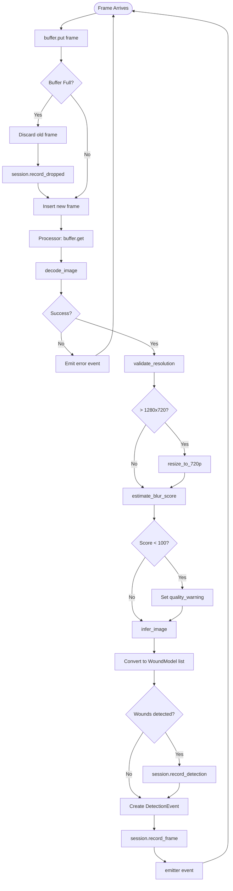
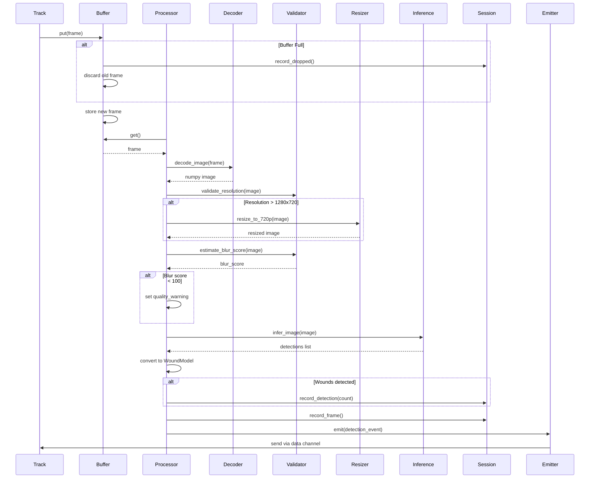
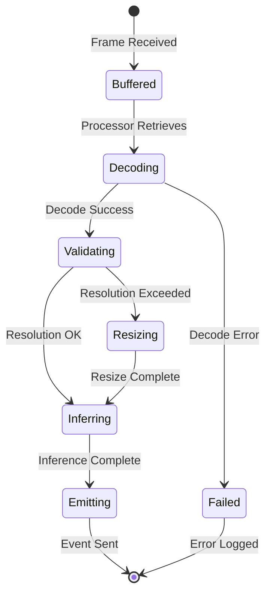

# Video Frame Processing Pipeline

## Context

**Bounded Context:** Media Processing

## Summary

When a video [Track](../ubiquitous-language.md#track) delivers frames via WebRTC, each frame flows through a multi-stage pipeline: buffering with drop-replace policy, decoding from WebRTC format to NumPy arrays, quality validation (resolution and blur detection), automatic resizing to 720p if needed, YOLO inference to detect wounds, and finally emission of a [Detection Event](../ubiquitous-language.md#detection-event) back to the client via the data channel.

## Description

This flow represents the core video analysis capability of the system. It prioritizes low latency over completeness by dropping buffered frames when backpressure occurs, ensuring the [Processor](../ubiquitous-language.md#processor) always works on the most recent frame. Quality checks warn clients when input quality may degrade detection accuracy. The pipeline is fully asynchronous and runs continuously until the track ends.

## Actors

- **WebRTC Track**: Delivers raw video frames from client's camera
- **Frame Buffer**: Temporary single-slot queue implementing drop-replace policy
- **Video Processor**: Async worker executing the processing pipeline
- **Frame Decoder**: Converts WebRTC frames to NumPy image arrays
- **Validator**: Checks image resolution and blur score
- **Resizer**: Scales images to target resolution (720p)
- **Inference Service**: Runs YOLO model to detect wounds
- **Emitter**: Sends detection events through data channel to client

## Preconditions

- [Session](../ubiquitous-language.md#session) is active and connected
- Video track is delivering frames
- [Frame Buffer](../ubiquitous-language.md#frame-buffer) is initialized with maxsize=1
- Video Processor is started with emitter callback
- [Data Channel](../ubiquitous-language.md#data-channel) is open (for event emission)

## Main Flow

1. WebRTC video track receives frame from client camera/screen capture
2. Track handler calls `buffer.put(frame)` to enqueue frame
3. **If buffer is full** (contains 1 frame), existing frame is discarded, `session.record_dropped()` called, and new frame replaces it
4. **If buffer is empty**, frame is added directly
5. Video Processor awaits `buffer.get()` and retrieves the frame
6. Processor calls `decode_image(frame)` to convert to NumPy array (HxWxC uint8)
7. **If decode fails**, error is logged, error event emitted, flow returns to step 5
8. Processor calls `validate_resolution(image)` to check dimensions
9. **If resolution exceeds 1280x720**, processor calls `resize_to_720p(image)` to scale down
10. Processor calls `estimate_blur_score(image)` using Laplacian variance
11. **If blur score < 100.0**, quality warning string created: `"blurry:score=X.X"`
12. Processor calls `infer_image(image)` to run YOLO model (async)
13. Inference returns list of detection dictionaries: `[{id, cls, bbox, confidence, type_confidence}, ...]`
14. Processor converts detection dicts to [Wound](../ubiquitous-language.md#wound) models (`WoundModel` instances)
15. **If wounds list is not empty**, processor calls `session.record_detection(count)`
16. Processor creates [Detection Event](../ubiquitous-language.md#detection-event) with session_id, timestamp_ms, frame_index, has_wounds, wounds, metadata
17. Processor calls `session.record_frame()` to increment frame_count and update last_activity
18. Processor calls `emitter(event)` to send JSON event through data channel
19. **If emission succeeds**, event is logged and flow returns to step 5 for next frame
20. **If emission fails** (channel closed), error is logged, flow continues to step 5

## Alternative Flows

### A1: Frame Decode Failure

**Trigger:** `decode_image()` raises exception (corrupted frame, unsupported format)

**Steps:**
1. Exception caught in processor
2. Error logged with frame metadata
3. Error event created: `{error: "decode_failed", frame_index: N}`
4. Error event emitted to client (if channel open)
5. Session counters updated (frame not counted as processed)
6. Processor continues to next frame

**Outcome:** Frame skipped, client notified, processing continues

### A2: Quality Warning — Blurry Frame

**Trigger:** Blur score falls below threshold (DEFAULT_BLUR_THRESHOLD = 100.0)

**Steps:**
1. `is_blurry(image)` returns True
2. Quality warning string formatted: `"blurry:score={score}"`
3. Warning included in detection event metadata
4. Detection event emitted with quality_warning field populated
5. Client receives event and can display warning UI

**Outcome:** Detection proceeds but client is informed of quality issue

### A3: No Wounds Detected

**Trigger:** YOLO inference returns empty predictions list

**Steps:**
1. `infer_image()` returns `[]`
2. Wounds list remains empty
3. Detection event created with `has_wounds: false` and empty wounds array
4. Event emitted normally
5. Session detection_count not incremented

**Outcome:** Clean frame reported to client; processing continues

### A4: Buffer Backpressure — Frame Dropped

**Trigger:** New frame arrives while buffer already contains a frame

**Steps:**
1. `buffer.put(frame)` called on full buffer
2. Existing frame retrieved via `get_nowait()` and discarded
3. `buffer.dropped_count` incremented
4. `session.record_dropped()` called
5. New frame inserted into buffer
6. Drop event logged with session_id and dropped_count

**Outcome:** Older frame discarded to maintain low latency; total drops tracked

### A5: Inference Timeout or Error

**Trigger:** YOLO model call hangs or crashes

**Steps:**
1. `infer_image()` raises exception or timeout
2. Exception caught by processor
3. Error event created with error message
4. Empty wounds list emitted
5. Processing continues with next frame

**Outcome:** Single frame skipped, client notified, system remains stable

## Business Rules

- **Drop-Replace Policy:** Buffer capacity is always 1; newest frame always replaces oldest
- **Low Latency Priority:** System prefers dropping frames to introducing queuing delays
- **Quality Threshold:** Blur score < 100.0 triggers quality warning
- **Resolution Limit:** Images exceeding 1280x720 must be resized before inference
- **Frame Indexing:** Frame index is sequential per session, incremented after successful processing
- **Detection Confidence:** Only detections meeting configured threshold are included (default 0.5)
- **Event Ordering:** Events are emitted in frame processing order (not necessarily arrival order if drops occur)

## Data / Events

### Input: WebRTC Video Frame

Binary video frame (JPEG or raw format) from MediaStreamTrack

### Output: Detection Event (JSON via Data Channel)

```json
{
  "event_type": "detection_event",
  "session_id": "550e8400-e29b-41d4-a716-446655440000",
  "timestamp_ms": 1640995200123,
  "frame_index": 42,
  "has_wounds": true,
  "wounds": [
    {
      "id": 0,
      "cls": "cut",
      "bbox": [120.5, 200.3, 45.0, 60.0],
      "confidence": 0.92,
      "type_confidence": 0.88
    }
  ],
  "metadata": {
    "quality_warning": null,
    "processing_time_ms": 0
  }
}
```

### Output: Error Event (JSON via Data Channel)

```json
{
  "event_type": "error_event",
  "session_id": "550e8400-e29b-41d4-a716-446655440000",
  "timestamp_ms": 1640995200456,
  "frame_index": 43,
  "error": "decode_failed"
}
```

## Flow Diagram



## Sequence Diagram



## State Transitions



## Acceptance Criteria / Tests

1. **Given** a valid frame in buffer, **when** processor retrieves it, **then** frame is decoded to NumPy array with shape (H, W, 3)
2. **Given** image resolution > 1280x720, **when** processing occurs, **then** image is resized to fit within 720p bounds
3. **Given** blur score < 100, **when** processing completes, **then** detection event includes quality_warning field
4. **Given** YOLO detects 2 wounds, **when** event is emitted, **then** event contains 2 WoundModel objects
5. **Given** buffer is full, **when** new frame arrives, **then** old frame is dropped and session.dropped_count increases
6. **Given** decode fails, **when** error occurs, **then** error event is emitted and processing continues
7. **Given** successful frame processing, **when** event emitted, **then** session.frame_count increments by 1

## Related Domain Terms

- [Frame](../ubiquitous-language.md#frame)
- [Frame Buffer](../ubiquitous-language.md#frame-buffer)
- [Frame Processor](../ubiquitous-language.md#frame-processor)
- [Inference](../ubiquitous-language.md#inference)
- [Wound](../ubiquitous-language.md#wound)
- [Detection Event](../ubiquitous-language.md#detection-event)
- [Blur Score](../ubiquitous-language.md#blur-score)
- [Quality Warning](../ubiquitous-language.md#quality-warning)
- [Drop-Replace Policy](../ubiquitous-language.md#drop-replace-policy)
- [Bounding Box](../ubiquitous-language.md#bounding-box)
- [Confidence](../ubiquitous-language.md#confidence)

## Related Flows

- [WebRTC Session Establishment](webrtc-session-establishment.md) — precedes this flow
- [Wound Detection and Alert Generation](wound-detection-and-alert-generation.md) — triggered by wound detections
- [Inference Fallback Handling](inference-fallback-handling.md) — handles inference failures
- [Session Closure and Reporting](session-closure-and-reporting.md) — terminates processing loop

## Notes & Open Questions

- **Q:** What happens if frames arrive faster than processor can handle?  
  **A:** Drop-replace policy ensures buffer never grows beyond 1; older frames discarded.

- **Q:** Should resizing preserve aspect ratio?  
  **A:** Yes, `resize_to_720p` maintains aspect ratio and fits within 1280x720 bounds.

- **Q:** Can processor handle multiple concurrent sessions?  
  **A:** Yes, each session has independent processor instance and buffer.

- **Missing Term:** "Laplacian variance" (blur detection algorithm) is not explained in ubiquitous-language.md.

## Changelog

| Date       | Author                      | Change                        |
|------------|-----------------------------|-------------------------------|
| 2026-01-24 | flow-documentation-agent    | Initial flow documentation    |
