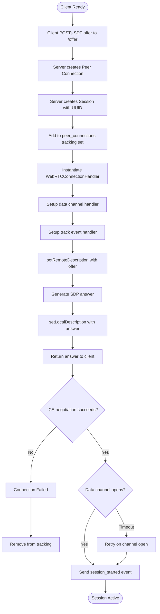
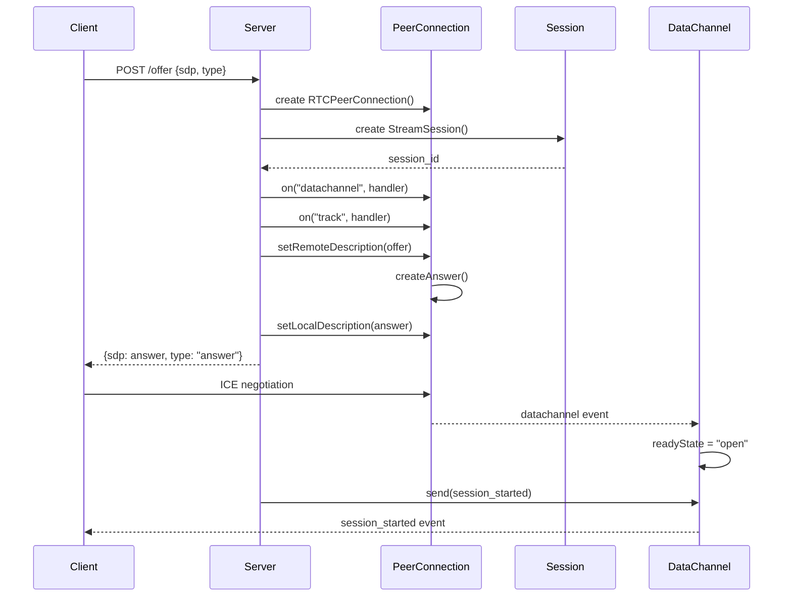
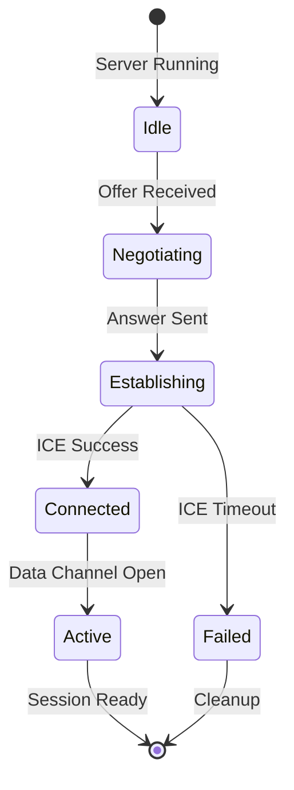

# WebRTC Session Establishment

## Context

**Bounded Context:** Streaming Infrastructure

## Summary

A client initiates a WebRTC connection with the server by exchanging SDP offer/answer messages, establishing a peer connection, and activating the data channel for bidirectional communication. The server creates a unique session, configures track handlers, and notifies the client when ready to receive media streams.

## Description

This flow handles the initial handshake between client and server that enables real-time media streaming and detection event delivery. The process uses standard WebRTC signaling (SDP offer/answer exchange) and establishes both media tracks (for video/audio) and a data channel (for JSON event messages). The session serves as the container for all subsequent processing activity and metrics tracking.

## Actors

- **Client Application**: Web browser or mobile app initiating the streaming session
- **API Server**: FastAPI/aiohttp application handling WebRTC signaling and session management
- **WebRTC Connection Handler**: Server-side component managing peer connection lifecycle

## Preconditions

- Client has network connectivity to the server
- Server is running and listening on the configured port (default 8000)
- Client has access to camera/microphone permissions (for media capture)

## Main Flow

1. Client sends HTTP POST request to `/offer` endpoint with SDP offer containing media capabilities and desired tracks
2. Server receives offer and creates a new [Peer Connection](../ubiquitous-language.md#peer-connection)
3. Server instantiates a [Session](../ubiquitous-language.md#session) with unique session_id (UUID v4) and initializes counters
4. Server adds peer connection to global tracking set for cleanup management
5. Server creates WebRTCConnectionHandler instance and binds it to the peer connection
6. Server configures data channel event handler listening for "detections" label
7. Server configures track event handler to process incoming media streams
8. Server calls setRemoteDescription with client's SDP offer
9. Server generates SDP answer describing server capabilities and selected media formats
10. Server calls setLocalDescription with the generated answer
11. Server returns SDP answer to client in HTTP response body
12. Client receives answer and completes WebRTC negotiation
13. WebRTC connection establishes (ICE candidates exchanged, DTLS handshake)
14. [Data Channel](../ubiquitous-language.md#data-channel) transitions to "open" state
15. Server sends `session_started` event through data channel with session_id and configuration
16. Client receives session initialization message and begins streaming media

## Alternative Flows

### A1: Offer Validation Failure

**Trigger:** Client sends malformed SDP or missing required fields

**Steps:**
1. Server validation fails during offer parsing
2. Server returns HTTP 400 Bad Request with error details
3. Flow terminates, no session created

**Outcome:** Client must retry with corrected offer

### A2: Peer Connection Failure

**Trigger:** Network issues prevent WebRTC connection establishment

**Steps:**
1. SDP exchange succeeds but ICE negotiation fails
2. Connection timeout occurs (no viable ICE candidate pairs)
3. Peer connection transitions to "failed" state
4. Server cleanup handler removes peer connection from tracking
5. Client receives connection failure callback

**Outcome:** Session never transitions to active state; client must retry connection

### A3: Data Channel Delayed Activation

**Trigger:** Data channel takes longer than expected to open

**Steps:**
1. Session initialization message send attempt fails (channel not "open")
2. Server logs warning but continues waiting
3. When channel opens, server retries session_started message
4. Client receives delayed initialization

**Outcome:** Session proceeds normally with delayed start notification

## Business Rules

- Every session must have a globally unique session_id generated server-side
- Peer connections must be tracked for orderly shutdown on server termination
- Data channel label must be exactly "detections" (case-sensitive)
- Session initialization message must be sent within DATA_CHANNEL_INIT_DELAY (0.1 seconds) of channel opening
- Session start_time is recorded at Session instantiation and never changes
- Session configuration includes max_resolution (1280x720), confidence_threshold (0.5), and idle_timeout_sec (30)

## Data / Events

### Input: SDP Offer (HTTP POST /offer)

```json
{
  "sdp": "<SDP offer string>",
  "type": "offer"
}
```

### Output: SDP Answer (HTTP Response)

```json
{
  "sdp": "<SDP answer string>",
  "type": "answer"
}
```

### Output: Session Started Event (Data Channel)

```json
{
  "event_type": "session_started",
  "session_id": "550e8400-e29b-41d4-a716-446655440000",
  "timestamp_ms": 1640995200000,
  "config": {
    "max_resolution": "1280x720",
    "confidence_threshold": 0.5,
    "idle_timeout_sec": 30
  }
}
```

## Flow Diagram



## Sequence Diagram



## State Transitions



## Acceptance Criteria / Tests

1. **Given** a valid SDP offer, **when** POST /offer is called, **then** server returns 200 with valid SDP answer
2. **Given** peer connection established, **when** data channel opens, **then** session_started event is sent within 0.1 seconds
3. **Given** malformed SDP, **when** POST /offer is called, **then** server returns 400 error
4. **Given** multiple concurrent clients, **when** each sends offers, **then** each receives unique session_id
5. **Given** session created, **when** session.session_id is checked, **then** it matches UUID v4 format
6. **Given** peer connection added to tracking, **when** server shutdown occurs, **then** all connections are closed cleanly

## Related Domain Terms

- [Session](../ubiquitous-language.md#session)
- [Peer Connection](../ubiquitous-language.md#peer-connection)
- [Data Channel](../ubiquitous-language.md#data-channel)
- [Track](../ubiquitous-language.md#track)
- [Stream](../ubiquitous-language.md#stream)
- [Emitter](../ubiquitous-language.md#emitter)

## Related Flows

- [Video Frame Processing Pipeline](video-frame-processing-pipeline.md) — follows after session establishment
- [Audio Analysis Pipeline](audio-analysis-pipeline.md) — parallel audio processing after session establishment
- [Session Closure and Reporting](session-closure-and-reporting.md) —终止 session lifecycle

## Notes & Open Questions

- **Q:** Should the server support multiple concurrent sessions from the same client IP?  
  **A:** Currently no restrictions; each connection creates independent session.

- **Q:** What happens if client sends offer without media tracks?  
  **A:** Connection succeeds but no processing occurs; idle timeout will eventually close session.

- **Q:** Is STUN/TURN server configuration required for NAT traversal?  
  **A:** Not documented; likely required for production deployment behind firewalls.

- **Missing Term:** "ICE Candidate" is referenced but not defined in ubiquitous-language.md. Consider adding.

## Changelog

| Date       | Author                      | Change                        |
|------------|-----------------------------|-------------------------------|
| 2026-01-24 | flow-documentation-agent    | Initial flow documentation    |
