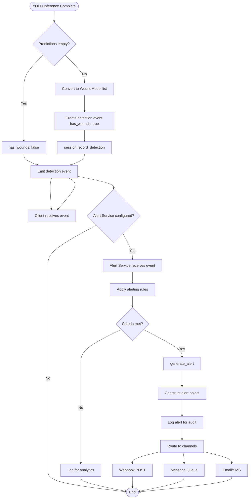
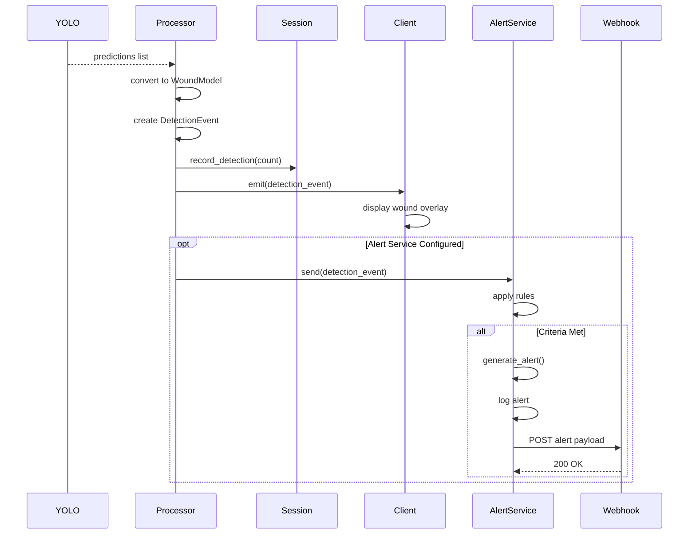
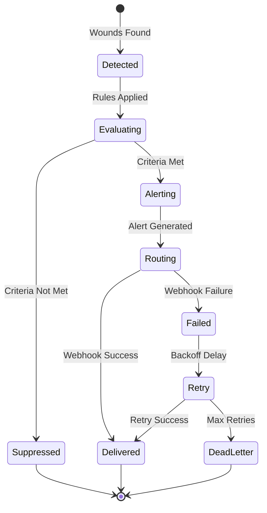

# Wound Detection and Alert Generation

## Context

**Bounded Context:** Detection and Alerting

## Summary

When YOLO [Inference](../ubiquitous-language.md#inference) detects one or more [Wounds](../ubiquitous-language.md#wound) in a video frame, the system creates a [Detection Event](../ubiquitous-language.md#detection-event) with wound details and optionally triggers the [Alert](../ubiquitous-language.md#alert) service to generate notifications for downstream consumers (webhooks, monitoring dashboards, care providers).

## Description

This flow bridges real-time detection with actionable alerting. While the video processing pipeline emits detection events for every frame (including frames with no detections), the alert service provides higher-level aggregation, filtering, and routing capabilities. Alerts can be configured with rules (e.g., "alert if 3+ wounds detected in a single frame" or "alert if wounds detected in 5 consecutive frames").

## Actors

- **Video Processor**: Emits detection events containing wound lists
- **Alert Service**: Consumes detection events and applies alerting rules
- **Wound Detection Aggregate**: Domain object containing frame metadata and wound list
- **Notification Router**: Delivers alerts to external systems (webhooks, SMS, email)
- **Client Application**: Receives real-time detection events via data channel

## Preconditions

- Video processing pipeline is active and processing frames
- YOLO model is loaded and returning predictions
- Alert service is configured (optional; system works without it)
- Detection threshold met (e.g., confidence >= 0.5)

## Main Flow

1. Video Processor completes inference on a frame
2. YOLO model returns non-empty predictions list: `[{id, cls, bbox, confidence, type_confidence}, ...]`
3. Processor converts predictions to [Wound](../ubiquitous-language.md#wound) models (WoundModel instances)
4. Processor creates [Detection Event](../ubiquitous-language.md#detection-event):
   - `session_id`
   - `timestamp_ms`
   - `frame_index`
   - `has_wounds: true`
   - `wounds: [WoundModel, ...]`
   - `metadata: {quality_warning?, processing_time_ms}`
5. Processor calls `session.record_detection(len(wounds))` to increment detection counter
6. Processor emits detection event to client via data channel
7. Client receives detection event and displays wound overlay on video
8. **Optionally**, detection event is also sent to Alert Service (if configured)
9. Alert Service receives detection event
10. Alert Service extracts wound list from event
11. Alert Service applies business rules to determine if alert should be generated:
    - **Rule 1**: "Alert if any wounds detected" (basic rule)
    - **Rule 2**: "Alert if wound count >= threshold" (e.g., >= 3 wounds)
    - **Rule 3**: "Alert if confidence >= high_confidence_threshold" (e.g., >= 0.9)
    - **Rule 4**: "Alert if specific wound class detected" (e.g., "severe_laceration")
12. **If alert criteria met**, Alert Service calls `generate_alert(detection_event)`
13. Alert Service constructs alert object:
    - `alert_id` (UUID)
    - `session_id`
    - `timestamp_ms`
    - `alert_type: "wound_detected"`
    - `severity: "low" | "medium" | "high"` (based on wound count/confidence)
    - `details`: wound descriptions, frame index, screenshot URL?
14. Alert Service logs alert for audit trail
15. Alert Service routes alert to configured channels:
    - Webhook POST to external URL
    - Message to message queue (e.g., RabbitMQ, Kafka)
    - Email/SMS via notification gateway
    - Dashboard update via WebSocket
16. External systems receive alert and take action (e.g., dispatch medical personnel)

## Alternative Flows

### A1: No Wounds Detected

**Trigger:** YOLO inference returns empty predictions list

**Steps:**
1. Processor creates detection event with `has_wounds: false` and empty wounds array
2. Event emitted to client normally
3. Alert Service (if subscribed) receives event but applies no rules (no wounds = no alert)
4. No alert generated

**Outcome:** Clean frame reported; no alerts triggered

### A2: Alert Service Not Configured

**Trigger:** Alert Service disabled or not integrated with processor

**Steps:**
1. Detection event emitted to client via data channel (normal flow)
2. No alert service receives the event
3. Client handles detection independently (displays UI, stores locally)

**Outcome:** Real-time detection works; alerting layer not activated

### A3: Low Confidence Detections Filtered

**Trigger:** Wounds detected but all have confidence < 0.5

**Steps:**
1. YOLO returns predictions with low confidence
2. Predictions filtered by confidence threshold before conversion to WoundModel
3. Filtered list is empty
4. Detection event emitted with `has_wounds: false`
5. No alert generated

**Outcome:** Uncertain detections suppressed to reduce false positives

### A4: Alert Threshold Not Met

**Trigger:** Wounds detected but count below alert threshold (e.g., only 1 wound, threshold is 3)

**Steps:**
1. Detection event created with 1 wound
2. Event emitted to client
3. Alert Service receives event
4. Rule evaluation: "1 < 3" → criteria not met
5. Alert not generated
6. Event logged for analytics

**Outcome:** Detection reported but not escalated; low severity ignored

### A5: Webhook Delivery Failure

**Trigger:** Alert generated but webhook endpoint unreachable

**Steps:**
1. Alert criteria met, alert object created
2. Alert Service attempts HTTP POST to webhook URL
3. Request times out or returns 500 error
4. Alert Service logs delivery failure
5. **Retry logic** (if configured): retry after backoff delay
6. **If all retries fail**: alert stored in dead-letter queue for manual review

**Outcome:** Alert generation succeeds but delivery deferred; system remains operational

### A6: Consecutive Wound Detections (Pattern-Based Alert)

**Trigger:** Wounds detected in 5+ consecutive frames

**Steps:**
1. Alert Service maintains detection history per session
2. Each detection event appends to history buffer
3. When buffer contains 5 consecutive frames with wounds:
   - Pattern rule triggered
   - Higher severity alert generated ("persistent_wound_detected")
4. Alert emitted with elevated priority

**Outcome:** Sustained detection patterns escalated differently than single-frame detections

## Business Rules

- **Confidence Threshold:** Only wounds with confidence >= configured threshold (default 0.5) are included
- **Alert Deduplication:** Repeated similar alerts within time window should be suppressed to avoid spam
- **Severity Mapping:**
  - 1 wound: Low severity
  - 2-4 wounds: Medium severity
  - 5+ wounds: High severity
- **Class-Based Priority:** Certain wound classes (e.g., "severe_laceration") may always trigger high-severity alerts
- **Rate Limiting:** Alert Service should rate-limit alerts per session (e.g., max 1 alert per 10 seconds)
- **Audit Trail:** All alerts must be logged with session_id, timestamp, and reasoning for compliance
- **Idempotency:** Same detection event should not generate multiple alerts

## Data / Events

### Input: Detection Event (from Video Processor)

```json
{
  "event_type": "detection_event",
  "session_id": "550e8400-e29b-41d4-a716-446655440000",
  "timestamp_ms": 1640995200123,
  "frame_index": 42,
  "has_wounds": true,
  "wounds": [
    {
      "id": 0,
      "cls": "cut",
      "bbox": [120.5, 200.3, 45.0, 60.0],
      "confidence": 0.92,
      "type_confidence": 0.88
    },
    {
      "id": 1,
      "cls": "bruise",
      "bbox": [300.0, 150.0, 60.0, 55.0],
      "confidence": 0.85,
      "type_confidence": 0.82
    }
  ],
  "metadata": {
    "quality_warning": null,
    "processing_time_ms": 0
  }
}
```

### Output: Alert Object

```json
{
  "alert_id": "a1b2c3d4-e5f6-7890-abcd-ef1234567890",
  "session_id": "550e8400-e29b-41d4-a716-446655440000",
  "timestamp_ms": 1640995200123,
  "alert_type": "wound_detected",
  "severity": "medium",
  "wound_count": 2,
  "details": {
    "frame_index": 42,
    "wounds": [
      {"cls": "cut", "confidence": 0.92},
      {"cls": "bruise", "confidence": 0.85}
    ]
  }
}
```

### Webhook Payload (External Notification)

```json
{
  "alert_id": "a1b2c3d4-e5f6-7890-abcd-ef1234567890",
  "event": "wound_detected",
  "severity": "medium",
  "session_id": "550e8400-e29b-41d4-a716-446655440000",
  "timestamp": "2022-01-01T12:00:00.123Z",
  "wound_count": 2,
  "url": "https://app.example.com/sessions/550e8400-e29b-41d4-a716-446655440000"
}
```

## Flow Diagram



## Sequence Diagram



## State Transitions



## Acceptance Criteria / Tests

1. **Given** YOLO detects 2 wounds, **when** detection event created, **then** event contains 2 WoundModel objects
2. **Given** detection event with wounds, **when** Alert Service receives it, **then** alert criteria evaluated
3. **Given** alert criteria met (3+ wounds), **when** alert generated, **then** severity is "high"
4. **Given** alert generated, **when** webhook configured, **then** HTTP POST sent to webhook URL
5. **Given** webhook returns 500 error, **when** retry enabled, **then** alert retried after backoff
6. **Given** 5 consecutive frames with wounds, **when** pattern rule applied, **then** persistent_wound_detected alert generated
7. **Given** alert generated, **when** logged, **then** audit trail includes session_id, timestamp, and wound details

## Related Domain Terms

- [Wound](../ubiquitous-language.md#wound)
- [Wound Detection](../ubiquitous-language.md#wound-detection)
- [Detection Event](../ubiquitous-language.md#detection-event)
- [Alert](../ubiquitous-language.md#alert)
- [Inference](../ubiquitous-language.md#inference)
- [Confidence](../ubiquitous-language.md#confidence)
- [Bounding Box](../ubiquitous-language.md#bounding-box)

## Related Flows

- [Video Frame Processing Pipeline](video-frame-processing-pipeline.md) — produces detection events consumed by this flow
- [Inference Fallback Handling](inference-fallback-handling.md) — ensures inference always returns results

## Notes & Open Questions

- **Q:** Should alerts include frame snapshots or video clips?  
  **A:** Not currently implemented; could enhance alerts with visual evidence.

- **Q:** How to handle alert fatigue (too many alerts)?  
  **A:** Implement deduplication, rate limiting, and severity-based filtering.

- **Q:** Should alert rules be configurable per client/session?  
  **A:** Not currently; all sessions use same rules. Consider per-client configuration.

- **Q:** What wound classes are supported?  
  **A:** Not exhaustively documented; depends on YOLO model training. Common: cut, bruise, abrasion, laceration.

- **Missing Term:** "Webhook", "Dead-Letter Queue", "Alert Routing" not defined in ubiquitous-language.md.

## Changelog

| Date       | Author                      | Change                        |
|------------|-----------------------------|-------------------------------|
| 2026-01-24 | flow-documentation-agent    | Initial flow documentation    |
