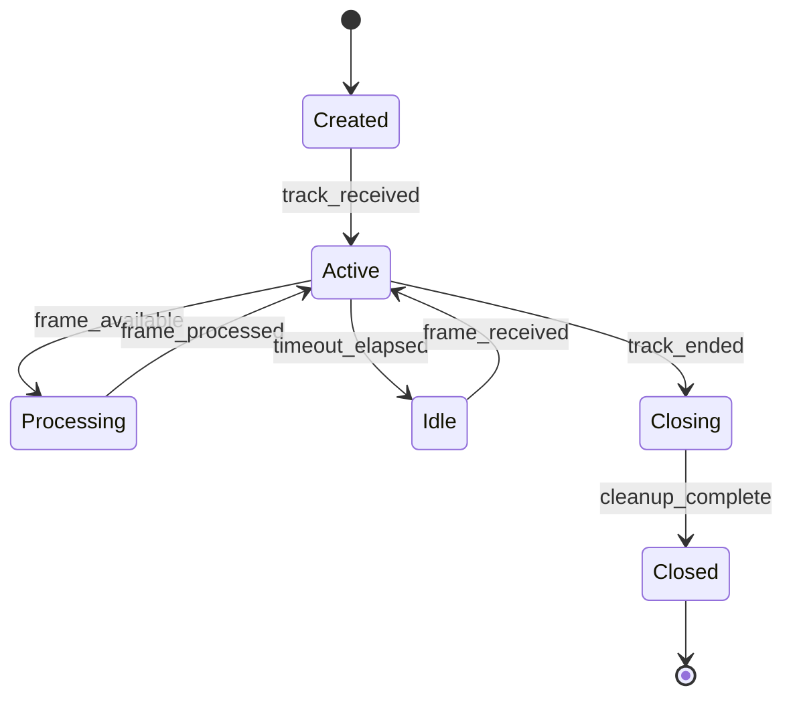
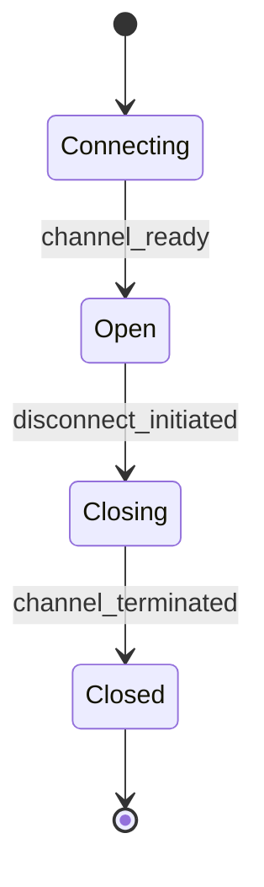
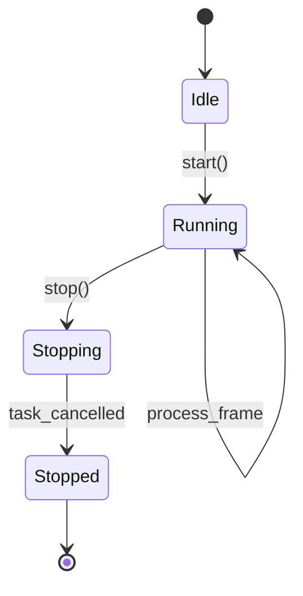

# Ubiquitous Language

## Overview

This document defines the business domain language for **yolo-rest**, a real-time streaming video and audio analysis system designed to detect facial wounds and psychological risk indicators in near real-time. The system accepts live media streams via WebRTC, processes frames and audio through YOLO-based computer vision models and speech emotion recognition, and emits detection events back to clients with low latency.

The domain centers around **streaming session lifecycle**, **media frame processing pipelines**, **wound detection inference**, and **quality-aware backpressure management**. The language reflects a stateless, event-driven architecture optimized for low-latency real-time analysis without persistent storage.

## Domain Glossary Index

- [Alert](#alert)
- [Audio Buffer](#audio-buffer)
- [Audio Frame](#audio-frame)
- [Audio Processor](#audio-processor)
- [Blur Score](#blur-score)
- [Bounding Box](#bounding-box)
- [Buffer](#buffer)
- [Confidence](#confidence)
- [Constants Configuration](#constants-configuration)
- [Data Channel](#data-channel)
- [Detection Event](#detection-event)
- [Drop-Replace Policy](#drop-replace-policy)
- [Emitter](#emitter)
- [Emotion Recognition](#emotion-recognition)
- [Fallback Inference](#fallback-inference)
- [Frame](#frame)
- [Frame Buffer](#frame-buffer)
- [Frame Index](#frame-index)
- [Frame Processor](#frame-processor)
- [Idle Timeout](#idle-timeout)
- [Inference](#inference)
- [Lazy Model Loader](#lazy-model-loader)
- [Local YOLO](#local-yolo)
- [Peer Connection](#peer-connection)
- [Processor](#processor)
- [Quality Warning](#quality-warning)
- [Rate Limiter](#rate-limiter)
- [Risk Score](#risk-score)
- [Roboflow Client](#roboflow-client)
- [Session](#session)
- [Session Summary](#session-summary)
- [Stream](#stream)
- [Track](#track)
- [Timestamp](#timestamp)
- [Wound](#wound)
- [Wound Detection](#wound-detection)

## Core Domain Concepts

### Session

**Type:** Aggregate

**Description:** A streaming session represents the complete lifecycle of a client's media analysis request from connection initiation to stream termination. Each session is uniquely identified, tracks frame and audio counters, measures throughput, records dropped frames due to backpressure, and calculates idle periods to detect inactive streams.

**Invariants:**
- Every session must have a unique session_id (UUID v4 by default)
- Session start_time is set at creation and never changes
- Session end_time is set only once when the session closes
- Frame counts (frame_count, audio_frame_count, total_received, dropped_count) are monotonically increasing
- A session is idle when (current_time - last_activity) > idle_timeout

**Related Terms:**
- [Frame Buffer](#frame-buffer)
- [Processor](#processor)
- [Track](#track)
- [Session Summary](#session-summary)

**Origin:** Inferred from [stream/session.py](../stream/session.py) (`StreamSession` class) which manages session state, counters, and lifecycle events.

---

### Wound

**Type:** Entity

**Description:** A wound represents a single detected injury or anomaly on a person's face identified by the YOLO model. Each wound has a unique identifier within a frame, a class label (e.g., "cut", "bruise", "abrasion"), a bounding box defining its location, and confidence scores indicating detection certainty and class type certainty.

**Invariants:**
- Each wound must have a unique id within a frame
- Bounding box coordinates must be non-negative floats [x, y, w, h] in absolute pixel coordinates
- Confidence and type_confidence must be floats between 0.0 and 1.0
- Class name (cls) must be a non-empty string

**Related Terms:**
- [Bounding Box](#bounding-box)
- [Confidence](#confidence)
- [Wound Detection](#wound-detection)
- [Frame](#frame)

**Origin:** Inferred from [models/detection.py](../models/detection.py) and [models/events.py](../models/events.py) (`Wound` and `WoundModel` data classes).

---

### Frame

**Type:** Value Object

**Description:** A frame is a single still image extracted from the video stream, representing a moment in time. Frames arrive via WebRTC tracks and are processed through a pipeline: decoding (from WebRTC/JPEG format to NumPy arrays), quality validation (resolution, blur detection), resizing (to 720p if necessary), and finally inference (YOLO model prediction). Each frame carries metadata including a frame index and timestamp.

**Invariants:**
- Frames are immutable once created
- Frames must be decodable to a valid NumPy image array (HxWxC)
- Frame resolution must not exceed MAX_WIDTH x MAX_HEIGHT (1280x720)
- Each frame has a sequential frame_index within a session

**Related Terms:**
- [Frame Buffer](#frame-buffer)
- [Frame Processor](#frame-processor)
- [Blur Score](#blur-score)
- [Quality Warning](#quality-warning)

**Origin:** Inferred from [preprocessing/frame_decoder.py](../preprocessing/frame_decoder.py), [preprocessing/validator.py](../preprocessing/validator.py), and [stream/frame_buffer.py](../stream/frame_buffer.py).

---

### Frame Buffer

**Type:** Entity

**Description:** A frame buffer is an asynchronous queue (asyncio.Queue with maxsize=1) that temporarily holds frames awaiting processing. It implements a drop-replace policy: when a new frame arrives and the buffer is full, the existing frame is immediately discarded and replaced with the newest one. This prioritizes low latency over completeness, ensuring the system always processes the most recent frame.

**Invariants:**
- Buffer capacity is always 1 (single-slot queue)
- When full, put() discards the existing frame before inserting the new one
- Dropped frames are counted and recorded in session.dropped_count
- Buffer must be thread-safe (async-safe via asyncio primitives)

**Related Terms:**
- [Drop-Replace Policy](#drop-replace-policy)
- [Frame](#frame)
- [Buffer](#buffer)
- [Session](#session)

**Origin:** Inferred from [stream/frame_buffer.py](../stream/frame_buffer.py) (`FrameBuffer` class implementing `BaseBuffer` abstract interface).

---

### Processor

**Type:** Service

**Description:** A processor is an async background worker responsible for continuously reading frames from a buffer, executing the detection pipeline (decode → validate → resize → infer), and emitting detection events back to the client. Processors manage their own lifecycle (start/stop), handle errors gracefully, and coordinate with the session to update counters and timestamps.

**Invariants:**
- A processor must be associated with exactly one buffer and one session
- Processor must implement start() and stop() lifecycle methods
- Processor runs as an asyncio task in the background
- Processor must call session.record_frame() for each successfully processed frame
- Processor must emit detection events via the provided emitter callable

**Related Terms:**
- [Frame Processor](#frame-processor)
- [Audio Processor](#audio-processor)
- [Emitter](#emitter)
- [Buffer](#buffer)
- [Session](#session)

**Origin:** Inferred from [stream/frame_processor.py](../stream/frame_processor.py) (`BaseProcessor` abstract class and `VideoProcessor` implementation).

---

### Detection Event

**Type:** Event

**Description:** A detection event is a real-time message emitted to the client whenever a frame has been processed. The event contains the session ID, timestamp, frame index, a flag indicating whether wounds were detected, a list of detected wounds, optional metadata (e.g., quality warnings), and an optional error field if processing failed.

**Invariants:**
- Every detection event must include session_id, timestamp_ms, frame_index
- has_wounds must be a boolean
- wounds must be a list (empty if no wounds detected)
- If error is present, processing failed and wounds list is likely empty
- timestamp_ms must be monotonically increasing within a session

**Related Terms:**
- [Wound](#wound)
- [Emitter](#emitter)
- [Session](#session)
- [Frame Index](#frame-index)

**Origin:** Inferred from [models/events.py](../models/events.py) (`DetectionEvent` Pydantic model) and [stream/frame_processor.py](../stream/frame_processor.py) (event emission logic).

---

### Inference

**Type:** Service

**Description:** Inference is the process of running a YOLO model (either via Roboflow hosted API or local Ultralytics model) on a prepared image to detect wounds. The inference service abstracts model selection, handles API calls or local model invocation, parses predictions into standardized detection dictionaries, and implements fallback logic when the primary inference source fails.

**Invariants:**
- Inference accepts a NumPy image array as input
- Inference returns a list of detection dictionaries (may be empty)
- Each detection must include: id, cls, bbox, confidence, type_confidence
- Inference must handle errors gracefully and never crash the processor
- When Roboflow API fails, fallback to local YOLO automatically if configured

**Related Terms:**
- [Roboflow Client](#roboflow-client)
- [Local YOLO](#local-yolo)
- [Fallback Inference](#fallback-inference)
- [Wound](#wound)

**Origin:** Inferred from [inference/roboflow_client.py](../inference/roboflow_client.py) and [inference/fallback.py](../inference/fallback.py).

---

### Lazy Model Loader

**Type:** Service

**Description:** A lazy model loader is a utility that defers the initialization of heavy machine learning models (e.g., YOLO, Wav2Vec2) until they are first needed. This improves startup time and memory usage by only loading models when inference is requested. The loader tracks loading state and handles errors gracefully.

**Invariants:**
- Models are loaded at most once per loader instance
- Loading failures are caught and logged
- Supports both synchronous and asynchronous usage patterns
- Thread-safe for concurrent access

**Related Terms:**
- [Local YOLO](#local-yolo)
- [Emotion Recognition](#emotion-recognition)
- [Inference](#inference)

**Origin:** Inferred from [utils/loader.py](../utils/loader.py) (`LazyModelLoader` class).

---

### Blur Score

**Type:** Value Object

**Description:** A blur score is a numerical measure of image sharpness calculated using the variance of the Laplacian operator applied to a grayscale version of the frame. Higher scores indicate sharper images. If the score falls below a threshold (default 100.0), the frame is flagged as blurry and a quality warning is emitted.

**Invariants:**
- Blur score must be a non-negative float
- Score is computed from grayscale conversion of the input image
- Lower scores indicate blurrier images (inverse relationship)
- If computation fails, score defaults to 0.0

**Related Terms:**
- [Quality Warning](#quality-warning)
- [Frame](#frame)

**Origin:** Inferred from [preprocessing/validator.py](../preprocessing/validator.py) (`estimate_blur_score` and `is_blurry` functions).

---

### Wound Detection

**Type:** Aggregate

**Description:** A wound detection aggregates all wounds detected in a single frame along with frame metadata (frame_index, timestamp_ms). It represents the complete result of processing one frame and is used internally before being transformed into a detection event.

**Invariants:**
- Each wound detection corresponds to exactly one frame
- Frame index must be a non-negative integer
- Timestamp must be in milliseconds (Unix epoch time)
- Wounds list may be empty (no detections)

**Related Terms:**
- [Wound](#wound)
- [Frame](#frame)
- [Detection Event](#detection-event)

**Origin:** Inferred from [models/detection.py](../models/detection.py) (`WoundDetection` dataclass).

---

### Stream

**Type:** Aggregate

**Description:** A stream represents the flow of media (video or audio) from the client to the server via WebRTC. Each stream is associated with a peer connection and contains one or more tracks. The stream lifecycle begins when a WebRTC connection is established and ends when the client disconnects or a timeout occurs.

**Invariants:**
- A stream must have at least one track (video or audio)
- Stream is bound to a single peer connection
- Stream ends trigger session closure and summary emission
- Stream must be associated with exactly one session

**Related Terms:**
- [Track](#track)
- [Peer Connection](#peer-connection)
- [Session](#session)

**Origin:** Inferred from [api/server.py](../api/server.py) (WebRTC peer connection and track handling logic).

---

### Track

**Type:** Entity

**Description:** A track is a single media channel within a WebRTC stream, representing either video frames or audio packets. Each track has a kind ("video" or "audio") and delivers media data continuously until the track ends. The system routes tracks to specialized processors based on their kind.

**Invariants:**
- Track kind must be either "video" or "audio"
- Each track is processed by exactly one processor (VideoProcessor or AudioProcessor)
- Track ending triggers processor shutdown and session closure
- Tracks are received via WebRTC MediaStreamTrack interface

**Related Terms:**
- [Stream](#stream)
- [Processor](#processor)
- [Frame](#frame)
- [Audio Frame](#audio-frame)

**Origin:** Inferred from [api/server.py](../api/server.py) (`on_track` event handler and `_handle_track` method).

---

## Supporting Domain Concepts

### Buffer

**Type:** Service

**Description:** A buffer is an abstract async queue interface for temporarily storing media items (frames or audio packets) awaiting processing. Buffers decouple media ingestion (from WebRTC tracks) from processing (by processors), enabling backpressure management and rate limiting.

**Related Terms:**
- [Frame Buffer](#frame-buffer)
- [Audio Buffer](#audio-buffer)
- [Processor](#processor)

**Origin:** Inferred from [stream/frame_buffer.py](../stream/frame_buffer.py) (`BaseBuffer` abstract class).

---

### Audio Buffer

**Type:** Entity

**Description:** An audio buffer is a specialized buffer optimized for audio frames with a larger queue size (default 1024) compared to frame buffers. It implements the same drop-replace policy but can hold multiple audio packets to accommodate audio windowing and batch processing.

**Related Terms:**
- [Buffer](#buffer)
- [Audio Frame](#audio-frame)
- [Audio Processor](#audio-processor)

**Origin:** Inferred from [stream/frame_buffer.py](../stream/frame_buffer.py) (`AudioBuffer` class).

---

### Audio Frame

**Type:** Value Object

**Description:** An audio frame is a packet of audio samples received from the WebRTC audio track. Audio frames are buffered, decoded to WAV format, and analyzed for features (MFCC, energy) or emotion recognition to compute psychological risk scores.

**Related Terms:**
- [Audio Buffer](#audio-buffer)
- [Emotion Recognition](#emotion-recognition)
- [Risk Score](#risk-score)

**Origin:** Inferred from [preprocessing/audio_converter.py](../preprocessing/audio_converter.py) and [audio/audio_analysis.py](../audio/audio_analysis.py).

---

### Frame Processor

**Type:** Service

**Description:** The frame processor (VideoProcessor) is a specialized processor that handles video frames. It decodes frames, validates quality, resizes images, runs YOLO inference, converts detections to wound models, and emits detection events with optional quality warnings.

**Related Terms:**
- [Processor](#processor)
- [Frame](#frame)
- [Inference](#inference)
- [Detection Event](#detection-event)

**Origin:** Inferred from [stream/frame_processor.py](../stream/frame_processor.py) (`VideoProcessor` class).

---

### Audio Processor

**Type:** Service

**Description:** The audio processor handles audio frames by collecting them in windows, converting to WAV format, extracting features (MFCC, energy), and running speech emotion recognition to compute risk scores. It emits audio-specific events with psychological risk indicators.

**Related Terms:**
- [Processor](#processor)
- [Audio Frame](#audio-frame)
- [Emotion Recognition](#emotion-recognition)
- [Risk Score](#risk-score)

**Origin:** Inferred from [stream/audio_processor.py](../stream/audio_processor.py) (`AudioProcessor` class).

---

### Emitter

**Type:** Service

**Description:** An emitter is an async callable function that sends detection events from processors back to clients via the WebRTC data channel. It handles serialization (JSON), checks data channel state, and logs emission attempts.

**Related Terms:**
- [Detection Event](#detection-event)
- [Data Channel](#data-channel)
- [Processor](#processor)

**Origin:** Inferred from [api/server.py](../api/server.py) (`_emit_event` method in `WebRTCConnectionHandler`).

---

### Peer Connection

**Type:** Entity

**Description:** A peer connection is a WebRTC RTCPeerConnection instance managing the network connection between client and server. It handles signaling (offer/answer SDP exchange), ICE candidate negotiation, track management, and data channel setup.

**Invariants:**
- Each peer connection is associated with exactly one session
- Peer connections must be tracked globally for cleanup on shutdown
- Closing a peer connection triggers session closure

**Related Terms:**
- [Stream](#stream)
- [Track](#track)
- [Data Channel](#data-channel)
- [Session](#session)

**Origin:** Inferred from [api/server.py](../api/server.py) (`WebRTCConnectionHandler` class and `peer_connections` global set).

---

### Data Channel

**Type:** Entity

**Description:** A data channel is a WebRTC DataChannel instance labeled "detections" used to send real-time JSON messages (detection events, session initialization, session summary) from the server back to the client. Messages are only sent when the channel is in "open" readyState.

**Invariants:**
- Data channel label must be "detections"
- Messages are sent only when readyState == "open"
- Data channel is created by the peer connection on datachannel event

**Related Terms:**
- [Detection Event](#detection-event)
- [Emitter](#emitter)
- [Peer Connection](#peer-connection)

**Origin:** Inferred from [api/server.py](../api/server.py) (`setup_data_channel_handler` and `_emit_event` methods).

---

### Bounding Box

**Type:** Value Object

**Description:** A bounding box defines the rectangular region around a detected wound using four float values: [x, y, w, h] where (x, y) is the top-left corner and (w, h) are width and height in absolute pixel coordinates. Bounding boxes are returned by YOLO models and preserved in wound objects.

**Related Terms:**
- [Wound](#wound)
- [Inference](#inference)

**Origin:** Inferred from [models/detection.py](../models/detection.py) and [inference/roboflow_client.py](../inference/roboflow_client.py) (bbox field in detection dictionaries).

---

### Confidence

**Type:** Value Object

**Description:** Confidence is a float between 0.0 and 1.0 indicating how certain the YOLO model is that a detection represents a real wound. Higher confidence values indicate greater certainty. A separate type_confidence value indicates certainty about the wound's class label.

**Related Terms:**
- [Wound](#wound)
- [Inference](#inference)

**Origin:** Inferred from [models/detection.py](../models/detection.py) (confidence and type_confidence fields in Wound dataclass).

---

### Quality Warning

**Type:** Value Object

**Description:** A quality warning is a metadata string included in detection events when image quality issues are detected (e.g., "blurry:score=45.2" when blur score is below threshold). Quality warnings inform clients that detections may be less reliable due to poor input quality.

**Related Terms:**
- [Blur Score](#blur-score)
- [Detection Event](#detection-event)
- [Frame](#frame)

**Origin:** Inferred from [stream/frame_processor.py](../stream/frame_processor.py) (`_check_image_quality` method).

---

### Roboflow Client

**Type:** Service

**Description:** The Roboflow client is a service that sends images to the Roboflow hosted API for YOLO inference. It encodes images to JPEG, makes HTTP POST requests with API key authentication, parses JSON responses into standardized detection dictionaries, and automatically falls back to local YOLO on failures.

**Related Terms:**
- [Inference](#inference)
- [Fallback Inference](#fallback-inference)
- [Local YOLO](#local-yolo)

**Origin:** Inferred from [inference/roboflow_client.py](../inference/roboflow_client.py) (`RoboflowConfig` and `infer_image` function).

---

### Local YOLO

**Type:** Service

**Description:** Local YOLO is a fallback inference service that runs Ultralytics YOLOv8 models locally (CPU or GPU) when the Roboflow API is unavailable or disabled. It loads model weights from disk (e.g., yolov8n.pt), runs synchronous predictions, and converts Ultralytics results to standardized detection dictionaries.

**Related Terms:**
- [Inference](#inference)
- [Fallback Inference](#fallback-inference)
- [Roboflow Client](#roboflow-client)

**Origin:** Inferred from [inference/fallback.py](../inference/fallback.py) (`LocalYoloFallback` class).

---

### Fallback Inference

**Type:** Service

**Description:** Fallback inference is the automatic switch from Roboflow hosted API to local YOLO model when the primary inference source fails (due to network errors, API errors, or misconfiguration). Fallback is controlled by the ROBOFLOW_USE_LOCAL_FALLBACK environment variable. The fallback chain is: Roboflow API → Local YOLO → Mock Generator (testing only).

**Invariants:**
- Fallback is attempted automatically without requiring explicit retry logic
- Each fallback step logs the attempt for observability
- If all fallback steps fail, the processor emits a detection event with error field populated

**Related Terms:**
- [Inference](#inference)
- [Roboflow Client](#roboflow-client)
- [Local YOLO](#local-yolo)

**Origin:** Inferred from [inference/roboflow_client.py](../inference/roboflow_client.py) (fallback logic in `infer_image` function).

---

### Constants Configuration

**Type:** Value Object

**Description:** Constants configuration is a centralized module defining all magic numbers and default values used across the application, including image dimensions, buffer sizes, timeouts, thresholds, and API defaults. Centralizing constants improves maintainability and makes it easier to tune system behavior.

**Invariants:**
- All constants are defined as module-level variables in [config/constants.py](../config/constants.py)
- Constants should never be modified at runtime
- New magic numbers should be added to this module rather than hardcoded elsewhere

**Related Terms:**
- [Frame Buffer](#frame-buffer)
- [Inference](#inference)
- [Quality Warning](#quality-warning)

**Origin:** Inferred from [config/constants.py](../config/constants.py).

---

### Emotion Recognition

**Type:** Service

**Description:** Emotion recognition is the process of analyzing audio features (MFCC, energy) or using speech emotion recognition models (Wav2Vec2) to classify emotional states and detect psychological risk indicators from voice characteristics.

**Related Terms:**
- [Audio Frame](#audio-frame)
- [Risk Score](#risk-score)
- [Audio Processor](#audio-processor)

**Origin:** Inferred from [audio/audio_analysis.py](../audio/audio_analysis.py) (`analyze_audio` function).

---

### Risk Score

**Type:** Value Object

**Description:** A risk score is a float value computed from audio analysis (MFCC mean × energy) indicating potential psychological risk. Scores above a threshold (e.g., 0.5) trigger alerts. Risk scores are heuristic and not clinical diagnoses.

**Related Terms:**
- [Emotion Recognition](#emotion-recognition)
- [Alert](#alert)
- [Audio Frame](#audio-frame)

**Origin:** Inferred from [audio/audio_analysis.py](../audio/audio_analysis.py) (risk_score field in analysis result).

---

### Alert

**Type:** Event

**Description:** An alert is a notification generated when anomalies are detected—either visual anomalies (wounds detected in video) or psychological risk indicators (high risk scores from audio). Alerts aggregate detection results and trigger downstream actions or notifications.

**Related Terms:**
- [Wound](#wound)
- [Risk Score](#risk-score)
- [Detection Event](#detection-event)

**Origin:** Inferred from [alerts/alert_service.py](../alerts/alert_service.py) (`generate_alert` function).

---

### Frame Index

**Type:** Value Object

**Description:** A frame index is a sequential integer (starting from 0) uniquely identifying each frame within a session. Frame indices are incremented by the processor and included in detection events to maintain temporal ordering.

**Related Terms:**
- [Frame](#frame)
- [Detection Event](#detection-event)
- [Session](#session)

**Origin:** Inferred from [stream/frame_processor.py](../stream/frame_processor.py) (frame_index counter in VideoProcessor).

---

### Timestamp

**Type:** Value Object

**Description:** A timestamp is an integer representing milliseconds since Unix epoch (January 1, 1970 UTC). Timestamps are attached to detection events to record when frames were processed, enabling clients to correlate events with real-world time.

**Related Terms:**
- [Detection Event](#detection-event)
- [Session](#session)

**Origin:** Inferred from [models/events.py](../models/events.py) (timestamp_ms field in DetectionEvent).

---

### Session Summary

**Type:** Value Object

**Description:** A session summary is a report generated when a session closes, containing metrics such as total frames received, frames processed, frames dropped due to backpressure, total detections emitted, audio frames received, audio seconds analyzed, and session duration. Summaries are sent to clients via the data channel.

**Invariants:**
- Summary is generated exactly once per session (when session.close() is called)
- All counters must be non-negative integers or floats
- Duration is computed as end_time - start_time

**Related Terms:**
- [Session](#session)
- [Data Channel](#data-channel)

**Origin:** Inferred from [stream/session.py](../stream/session.py) (`close` method returning summary dict) and [api/server.py](../api/server.py) (session summary emission logic).

---

### Idle Timeout

**Type:** Value Object

**Description:** An idle timeout is a duration (in seconds) after which a session is considered inactive if no frames or audio have been received. The default timeout is 30 seconds. Idle detection allows cleanup of stale connections.

**Invariants:**
- Idle timeout must be a positive integer (seconds)
- Session is idle when (current_time - last_activity) > idle_timeout

**Related Terms:**
- [Session](#session)

**Origin:** Inferred from [stream/session.py](../stream/session.py) (idle_timeout parameter and `is_idle` method).

---

### Drop-Replace Policy

**Type:** State

**Description:** Drop-replace is a backpressure management policy where the buffer discards the oldest item when full and immediately accepts the newest item. This policy prioritizes low latency over completeness, ensuring processors always work on the most recent data.

**Applies To:** [Frame Buffer](#frame-buffer), [Audio Buffer](#audio-buffer)

**Related Terms:**
- [Buffer](#buffer)
- [Frame Buffer](#frame-buffer)
- [Session](#session)

**Origin:** Inferred from [stream/frame_buffer.py](../stream/frame_buffer.py) (`put` method implementation in FrameBuffer and AudioBuffer).

---

### Rate Limiter

**Type:** Service

**Description:** A rate limiter controls the maximum number of concurrent operations (such as active stream processing sessions) using an async semaphore. It prevents resource exhaustion by queuing new requests when the limit is reached and releasing slots when operations complete. This is critical for preventing the server from being overwhelmed by too many simultaneous inference tasks.

**Invariants:**
- Maximum concurrent operations defined at initialization
- Acquire/release pairs must be balanced (use async context manager)
- Waiters are queued in FIFO order when limit is reached
- Thread-safe via asyncio primitives

**Related Terms:**
- [Session](#session)
- [Processor](#processor)
- [Drop-Replace Policy](#drop-replace-policy)

**Origin:** Inferred from [stream/rate_limiter.py](../stream/rate_limiter.py) (`RateLimiter` class).

---

## Domain Events

### Session Started

**Description:** Fired when a WebRTC connection is established and the first track is received. Signals the beginning of media analysis.

**Triggered By:** WebRTC peer connection setup and first track arrival.

**Resulting State Changes:**
- Session object created with unique session_id
- Session start_time recorded
- Buffer and processor initialized and started
- Session initialization message sent to client via data channel

**Related Terms:**
- [Session](#session)
- [Peer Connection](#peer-connection)
- [Data Channel](#data-channel)

---

### Frame Processed

**Description:** Fired after a frame has been decoded, validated, resized, and passed through YOLO inference. Represents successful completion of one iteration of the video processing pipeline.

**Triggered By:** Processor successfully processing a frame from the buffer.

**Resulting State Changes:**
- Session.frame_count incremented
- Session.last_activity timestamp updated
- Detection event emitted to client

**Related Terms:**
- [Frame](#frame)
- [Detection Event](#detection-event)
- [Session](#session)

---

### Wound Detected

**Description:** Fired when YOLO inference identifies one or more wounds in a frame. Indicates a positive detection requiring client attention or further action.

**Triggered By:** Inference returns non-empty list of detections with confidence above threshold.

**Resulting State Changes:**
- Detection event emitted with has_wounds=true and populated wounds list
- Session.detection_count incremented

**Related Terms:**
- [Wound](#wound)
- [Detection Event](#detection-event)
- [Inference](#inference)

---

### Frame Dropped

**Description:** Fired when a new frame arrives while the buffer is full, causing the existing frame to be discarded. Indicates backpressure and potential frame loss.

**Triggered By:** Buffer.put() called when buffer is at max capacity.

**Resulting State Changes:**
- Buffer.dropped_count incremented
- Session.dropped_count incremented
- Old frame removed from buffer, new frame inserted

**Related Terms:**
- [Frame Buffer](#frame-buffer)
- [Drop-Replace Policy](#drop-replace-policy)
- [Session](#session)

---

### Track Ended

**Description:** Fired when a WebRTC track stops delivering media, either due to client disconnection, timeout, or intentional stream closure.

**Triggered By:** WebRTC track ended event or error in track.recv() loop.

**Resulting State Changes:**
- Processor stopped
- Session closed (end_time recorded)
- Session summary generated and emitted
- Peer connection cleaned up and removed from tracking

**Related Terms:**
- [Track](#track)
- [Session](#session)
- [Session Summary](#session-summary)

---

### Quality Warning Detected

**Description:** Fired when image quality validation detects issues (blur score below threshold or resolution out of bounds). Warns clients that detection reliability may be reduced.

**Triggered By:** Frame validation checks fail during preprocessing.

**Resulting State Changes:**
- Quality warning string added to detection event metadata
- Detection event emitted with metadata.quality field populated

**Related Terms:**
- [Quality Warning](#quality-warning)
- [Blur Score](#blur-score)
- [Detection Event](#detection-event)

---

### Inference Fallback

**Description:** Fired when Roboflow API inference fails and the system automatically switches to local YOLO model.

**Triggered By:** Roboflow API HTTP error, timeout, or response parsing failure.

**Resulting State Changes:**
- Local YOLO model loaded (if not already loaded)
- Inference retried using local model
- Detection event emitted with inference source in metadata

**Related Terms:**
- [Fallback Inference](#fallback-inference)
- [Roboflow Client](#roboflow-client)
- [Local YOLO](#local-yolo)

---

### Session Closed

**Description:** Fired when a session completes, either normally (track ended) or abnormally (timeout, error). Marks the end of the session lifecycle.

**Triggered By:** Track ended event or explicit session closure.

**Resulting State Changes:**
- Session.end_time recorded
- Session summary computed and emitted to client
- All resources (processor, buffer, peer connection) cleaned up

**Related Terms:**
- [Session](#session)
- [Session Summary](#session-summary)
- [Track](#track)

---

## States and Lifecycles

### Session Lifecycle

**Applies To:** [Session](#session)

**Description:** Sessions transition through initialization, active processing, idle detection, and closure states.

**Possible Transitions:**
- Created → Active (first track received)
- Active → Idle (no activity for idle_timeout seconds)
- Idle → Active (new frame/audio received)
- Active → Closed (track ended)
- Idle → Closed (explicit cleanup or shutdown)

---

### Data Channel State

**Applies To:** [Data Channel](#data-channel)

**Description:** Data channels managed by WebRTC have internal states. The system only sends messages when the channel is in "open" state.

**Possible Transitions:**
- Connecting → Open (channel established)
- Open → Closing (peer disconnecting)
- Closing → Closed (channel terminated)

---

### Processor Lifecycle

**Applies To:** [Processor](#processor)

**Description:** Processors start as idle, begin processing when started, run continuously until stopped, and clean up resources on shutdown.

**Possible Transitions:**
- Idle → Running (start() called)
- Running → Running (loop iteration)
- Running → Stopping (stop() called)
- Stopping → Stopped (task cancelled)

---

## Open Questions and Ambiguities

### Database Schema Absence

**Question:** This project does not use a traditional database. All domain concepts are inferred from code structure and in-memory state management. Should persistent storage be considered for session history, detection logs, or model performance metrics?

**Impact:** If persistence is added in the future, the ubiquitous language may need new terms for entities like `PersistedSession`, `DetectionLog`, or `AuditTrail`.

---

### Wound Classification Taxonomy

**Question:** The wound class names (e.g., "cut", "bruise", "abrasion") are referenced in documentation but not defined in code. What is the complete taxonomy of wound types? Are these domain-specific medical terms or simplified labels?

**Impact:** The language should document the full wound classification hierarchy and any business rules around wound severity or treatment urgency.

---

### Risk Score Interpretation

**Question:** Risk scores computed from audio analysis are heuristic values without clear clinical interpretation. What threshold constitutes "high risk"? Should risk scores map to discrete risk levels (low/medium/high)?

**Impact:** Business stakeholders may need clearer definitions and documented decision thresholds for risk-based alerting.

---

### Alert Routing and Persistence

**Question:** The `generate_alert` function creates alert messages but does not specify how alerts are delivered (email, SMS, webhook?) or stored. What is the complete alert lifecycle?

**Impact:** If alerts trigger external workflows, the language should include terms like `AlertDelivery`, `AlertChannel`, or `AlertHistory`.

---

### Multi-Model Inference Strategy

**Question:** The system supports Roboflow API and local YOLO fallback. Are there plans to support additional inference backends (e.g., TensorFlow Serving, AWS SageMaker)? How should model selection be expressed in the domain language?

**Impact:** A more general term like `InferenceBackend` or `ModelProvider` may be needed to accommodate future expansion.

---

### Frame Index Reset Behavior

**Question:** Frame indices are sequential integers within a session. If a session reconnects or resumes, does the frame index reset or continue? What happens if frames arrive out of order?

**Impact:** The invariants for frame_index should clarify reset behavior and ordering guarantees.

---

### Quality Thresholds Configuration

**Question:** Blur thresholds and resolution limits are hardcoded constants. Should these be configurable per-session or per-client? Are there plans for adaptive quality thresholds based on model confidence?

**Impact:** If quality thresholds become session-specific, the language may need terms like `QualityProfile` or `SessionConfiguration`.

---

### Audio Windowing and Buffering Strategy

**Question:** Audio buffers are larger than frame buffers (1024 vs 1). What is the rationale for this size? How are audio windows assembled for emotion recognition? What happens if audio and video streams are not time-synchronized?

**Impact:** The language should explicitly define `AudioWindow`, `BufferSizing`, or `MediaSynchronization` if these are critical business concepts.

---

### Dual Model Representations

**Question:** The codebase contains both dataclass-based models ([models/detection.py](../models/detection.py): `Wound`, `WoundDetection`) and Pydantic models ([models/events.py](../models/events.py): `WoundModel`, `DetectionEvent`). Why do both exist? Is one considered legacy?

**Impact:** If dataclasses are legacy and Pydantic is the current standard, the codebase should be migrated to eliminate duplication. If both serve different purposes (internal vs API contract), this distinction should be explicitly documented in the ubiquitous language.

**Current Usage:**
- `Wound` (dataclass) - Used internally in detection.py
- `WoundModel` (Pydantic) - Used in DetectionEvent for API serialization
- Both have identical fields but different validation and serialization behavior

---

### Constants Management Strategy

**Question:** With the introduction of [config/constants.py](../config/constants.py), is there a policy for when to use environment variables vs hardcoded constants? Should constants be configurable per-session or remain application-wide?

**Impact:** If constants become session-specific or client-configurable, new terms like `SessionConfiguration` or `QualityProfile` may be needed to represent per-session overrides of default values.
